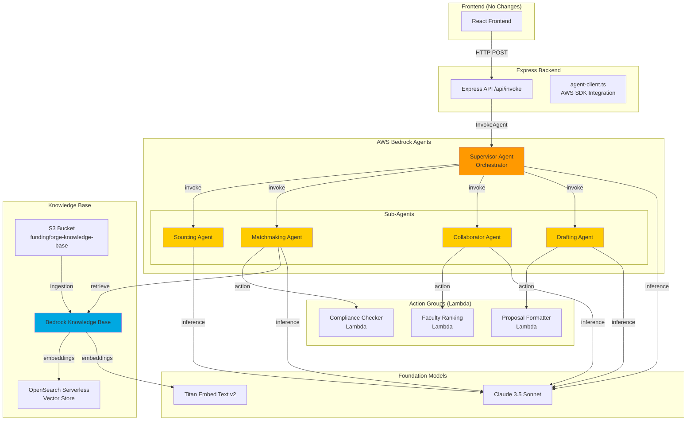
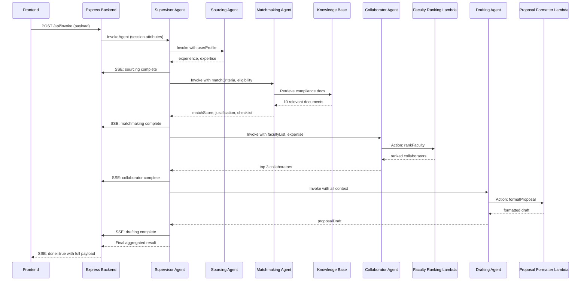
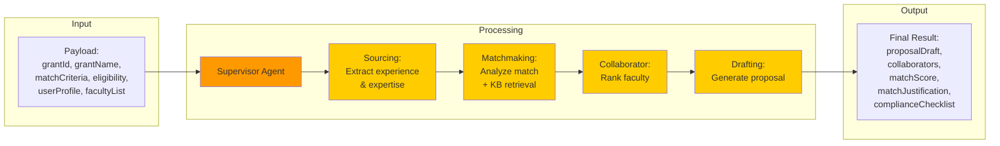

# Design Document: Full Bedrock Agents Migration

## Overview

This design document specifies the architecture for migrating FundingForge from a custom Strands Agents + FastAPI implementation to a fully AWS-managed Bedrock Agents solution. The migration replaces custom agent orchestration with AWS Bedrock's native multi-agent collaboration, integrates Knowledge Base for Amazon Bedrock for RAG capabilities, and refactors the Express backend to use AWS SDK APIs directly.

The implementation is structured for parallel development by 2 developers, with clear separation between AWS infrastructure setup and Express backend refactoring. The migration maintains complete frontend compatibility while providing enhanced scalability, observability, and reduced operational overhead.

### Key Design Goals

1. Replace custom orchestration with AWS Bedrock's managed multi-agent system
2. Integrate Knowledge Base for RAG-enhanced compliance checking
3. Maintain frontend API compatibility (no frontend changes required)
4. Enable parallel development tracks to minimize timeline
5. Provide comprehensive observability and cost monitoring
6. Ensure safe migration with validation and rollback capabilities

### Migration Scope

**Removed Components:**
- FastAPI agent service (agent-service/)
- Custom Strands agent implementations
- HTTP-based agent communication
- Manual orchestration logic

**Added Components:**
- Bedrock Supervisor Agent (orchestrator)
- 4 Bedrock Sub-Agents (Sourcing, Matchmaking, Collaborator, Drafting)
- Knowledge Base with S3 data source
- 3 Lambda Action Groups for custom logic
- AWS SDK integration in Express backend


## Architecture

### High-Level System Architecture



### Request Flow Diagram




### Data Flow Architecture



### Component Interaction Matrix

| Component | Invokes | Invoked By | Data Sources | Outputs |
|-----------|---------|------------|--------------|---------|
| **Supervisor Agent** | All Sub-Agents | Express Backend | Session State | Aggregated Result |
| **Sourcing Agent** | - | Supervisor | userProfile | experience, expertise |
| **Matchmaking Agent** | Compliance Checker Lambda | Supervisor | matchCriteria, eligibility, Knowledge Base | matchScore, justification, checklist |
| **Collaborator Agent** | Faculty Ranking Lambda | Supervisor | facultyList, expertise | top 3 collaborators |
| **Drafting Agent** | Proposal Formatter Lambda | Supervisor | All previous outputs | proposalDraft |
| **Knowledge Base** | - | Matchmaking Agent | S3 documents | Retrieved compliance docs |
| **Action Groups** | - | Sub-Agents | Lambda event params | Structured JSON |


## Components and Interfaces

### 1. Supervisor Agent (Orchestrator)

**Purpose:** Top-level agent that orchestrates the multi-agent proposal generation workflow.

**Configuration:**
```yaml
Agent Name: FundingForge-Supervisor
Foundation Model: anthropic.claude-3-5-sonnet-20241022-v2:0
Agent Alias: DRAFT (development), PROD (production)
Session Timeout: 600 seconds (10 minutes)
```

**Instructions:**
```
You are the Supervisor Agent for FundingForge, a grant proposal generation system.

Your role is to orchestrate four specialized sub-agents in sequence to generate comprehensive grant proposals:

1. Sourcing Agent - Extracts user experience and expertise from profile
2. Matchmaking Agent - Analyzes grant match and generates compliance checklist
3. Collaborator Agent - Identifies and ranks potential faculty collaborators
4. Drafting Agent - Generates the final proposal draft

WORKFLOW:
1. Receive input via session attributes: grantId, grantName, matchCriteria, eligibility, userProfile, facultyList
2. Invoke Sourcing Agent with userProfile
3. Invoke Matchmaking Agent with matchCriteria, eligibility, and sourced data
4. Invoke Collaborator Agent with facultyList and expertise from sourcing
5. Invoke Drafting Agent with all accumulated context
6. Aggregate all outputs into final result

OUTPUT FORMAT:
Return a JSON object with:
{
  "proposalDraft": "string",
  "collaborators": [{"name": "string", "department": "string", "expertise": "string", "imageUrl": "string", "bio": "string"}],
  "matchScore": number (0-100),
  "matchJustification": "string",
  "complianceChecklist": [{"task": "string", "category": "RAMP|COI|IRB|Policy", "status": "green|yellow|red"}]
}

PROGRESS UPDATES:
Emit progress after each sub-agent completes:
- "Sourcing complete: extracted experience and expertise"
- "Matchmaking complete: analyzed grant match"
- "Collaborator identification complete: ranked faculty"
- "Drafting complete: generated proposal"

ERROR HANDLING:
If any sub-agent fails, log the error and attempt to continue with partial results.
```

**IAM Role Permissions:**
```json
{
  "Version": "2012-10-17",
  "Statement": [
    {
      "Effect": "Allow",
      "Action": [
        "bedrock:InvokeAgent"
      ],
      "Resource": [
        "arn:aws:bedrock:us-east-1:ACCOUNT:agent/SOURCING_AGENT_ID",
        "arn:aws:bedrock:us-east-1:ACCOUNT:agent/MATCHMAKING_AGENT_ID",
        "arn:aws:bedrock:us-east-1:ACCOUNT:agent/COLLABORATOR_AGENT_ID",
        "arn:aws:bedrock:us-east-1:ACCOUNT:agent/DRAFTING_AGENT_ID"
      ]
    },
    {
      "Effect": "Allow",
      "Action": [
        "bedrock:InvokeModel"
      ],
      "Resource": "arn:aws:bedrock:us-east-1::foundation-model/anthropic.claude-3-5-sonnet-20241022-v2:0"
    },
    {
      "Effect": "Allow",
      "Action": [
        "logs:CreateLogGroup",
        "logs:CreateLogStream",
        "logs:PutLogEvents"
      ],
      "Resource": "arn:aws:logs:us-east-1:ACCOUNT:log-group:/aws/bedrock/agents/*"
    }
  ]
}
```

**Session State Schema:**
```typescript
interface SupervisorSessionState {
  sessionAttributes: {
    grantId: string;
    grantName: string;
    matchCriteria: string;
    eligibility: string;
    userProfile: string; // JSON stringified
    facultyList: string; // JSON stringified
  };
  promptSessionAttributes?: {
    currentStep: "sourcing" | "matchmaking" | "collaborator" | "drafting";
    sourcedData?: string;
    matchData?: string;
    collaboratorData?: string;
  };
}
```


### 2. Sourcing Sub-Agent

**Purpose:** Extracts user experience and expertise from the user profile.

**Configuration:**
```yaml
Agent Name: FundingForge-Sourcing
Foundation Model: anthropic.claude-3-5-sonnet-20241022-v2:0
Agent Alias: DRAFT
```

**Instructions:**
```
You are the Sourcing Agent for FundingForge.

Your role is to analyze a user's profile and extract relevant experience and expertise for grant proposals.

INPUT:
You will receive a userProfile object via session attributes containing:
- role: faculty position (e.g., "Assistant Professor")
- year: academic year (e.g., "2nd Year")
- program: department/program (e.g., "Computer Science")

TASK:
1. Analyze the user's role, year, and program
2. Infer relevant experience based on position and tenure
3. Identify key areas of expertise based on program
4. Extract any additional qualifications or specializations

OUTPUT FORMAT:
Return a JSON object:
{
  "experience": ["string array of experience items"],
  "expertise": ["string array of expertise areas"]
}

EXAMPLE:
Input: {"role": "Assistant Professor", "year": "2nd Year", "program": "Computer Science"}
Output: {
  "experience": [
    "2 years of faculty experience",
    "Early-career researcher",
    "Teaching and research responsibilities"
  ],
  "expertise": [
    "Computer Science",
    "Research methodology",
    "Academic instruction"
  ]
}

Be concise and relevant. Focus on information useful for grant matching.
```

**IAM Role Permissions:**
```json
{
  "Version": "2012-10-17",
  "Statement": [
    {
      "Effect": "Allow",
      "Action": "bedrock:InvokeModel",
      "Resource": "arn:aws:bedrock:us-east-1::foundation-model/anthropic.claude-3-5-sonnet-20241022-v2:0"
    }
  ]
}
```


### 3. Matchmaking Sub-Agent

**Purpose:** Analyzes grant match criteria and generates compliance checklists using Knowledge Base retrieval.

**Configuration:**
```yaml
Agent Name: FundingForge-Matchmaking
Foundation Model: anthropic.claude-3-5-sonnet-20241022-v2:0
Agent Alias: DRAFT
Knowledge Base: FundingForgeKnowledgeBase
Knowledge Base Retrieval:
  numberOfResults: 10
  searchType: HYBRID
```

**Instructions:**
```
You are the Matchmaking Agent for FundingForge.

Your role is to analyze how well a user matches a grant's criteria and generate a detailed compliance checklist.

INPUT:
- matchCriteria: Grant's matching requirements
- eligibility: Grant's eligibility criteria
- sourcedData: User's experience and expertise (from Sourcing Agent)

KNOWLEDGE BASE ACCESS:
You have access to a Knowledge Base containing:
- FSU grant policies
- Compliance requirements (RAMP, COI, IRB)
- Grant templates
- Historical compliance documents

TASK:
1. Retrieve relevant compliance documents from the Knowledge Base based on the grant criteria
2. Analyze the user's experience and expertise against matchCriteria
3. Calculate a match score (0-100) based on alignment
4. Generate a justification explaining the match score
5. Create a detailed compliance checklist with specific tasks

OUTPUT FORMAT:
{
  "matchScore": number (0-100),
  "matchJustification": "Detailed explanation of why this score was assigned",
  "complianceChecklist": [
    {
      "task": "Specific compliance task",
      "category": "RAMP" | "COI" | "IRB" | "Policy",
      "status": "green" | "yellow" | "red"
    }
  ]
}

COMPLIANCE CATEGORIES:
- RAMP: Research Administration and Management Portal tasks
- COI: Conflict of Interest disclosures
- IRB: Institutional Review Board requirements
- Policy: General FSU policy compliance

STATUS INDICATORS:
- green: Requirement met or easily achievable
- yellow: Requires attention or additional documentation
- red: Critical requirement not met or significant barrier

Use the retrieved documents to ensure compliance recommendations are accurate and specific to FSU policies.
```

**Action Groups:**
- Compliance Checker Lambda (for validating checklist items)

**IAM Role Permissions:**
```json
{
  "Version": "2012-10-17",
  "Statement": [
    {
      "Effect": "Allow",
      "Action": "bedrock:InvokeModel",
      "Resource": "arn:aws:bedrock:us-east-1::foundation-model/anthropic.claude-3-5-sonnet-20241022-v2:0"
    },
    {
      "Effect": "Allow",
      "Action": "bedrock:Retrieve",
      "Resource": "arn:aws:bedrock:us-east-1:ACCOUNT:knowledge-base/KB_ID"
    },
    {
      "Effect": "Allow",
      "Action": "lambda:InvokeFunction",
      "Resource": "arn:aws:lambda:us-east-1:ACCOUNT:function:ComplianceChecker"
    }
  ]
}
```


### 4. Collaborator Sub-Agent

**Purpose:** Identifies and ranks potential faculty collaborators based on expertise match.

**Configuration:**
```yaml
Agent Name: FundingForge-Collaborator
Foundation Model: anthropic.claude-3-5-sonnet-20241022-v2:0
Agent Alias: DRAFT
```

**Instructions:**
```
You are the Collaborator Agent for FundingForge.

Your role is to identify and rank potential faculty collaborators based on their expertise alignment with the grant requirements.

INPUT:
- facultyList: Array of faculty members with name, department, expertise, imageUrl, bio
- expertise: User's expertise areas (from Sourcing Agent)
- matchCriteria: Grant requirements

TASK:
1. Analyze each faculty member's expertise against the grant requirements
2. Use the Faculty Ranking action to calculate match scores
3. Rank faculty by relevance
4. Select the top 3 collaborators
5. Provide justification for each selection

OUTPUT FORMAT:
{
  "collaborators": [
    {
      "name": "Faculty Name",
      "department": "Department",
      "expertise": "Expertise areas",
      "imageUrl": "URL",
      "bio": "Biography or null",
      "matchReason": "Why this collaborator is a good fit"
    }
  ]
}

Return exactly 3 collaborators, ranked by relevance.

RANKING CRITERIA:
- Expertise alignment with grant requirements
- Complementary skills to user's expertise
- Departmental diversity (prefer cross-disciplinary teams)
- Research track record (inferred from bio if available)

Use the rankFaculty action to get objective match scores, then apply your judgment for final selection.
```

**Action Groups:**
- Faculty Ranking Lambda

**IAM Role Permissions:**
```json
{
  "Version": "2012-10-17",
  "Statement": [
    {
      "Effect": "Allow",
      "Action": "bedrock:InvokeModel",
      "Resource": "arn:aws:bedrock:us-east-1::foundation-model/anthropic.claude-3-5-sonnet-20241022-v2:0"
    },
    {
      "Effect": "Allow",
      "Action": "lambda:InvokeFunction",
      "Resource": "arn:aws:lambda:us-east-1:ACCOUNT:function:FacultyRanking"
    }
  ]
}
```


### 5. Drafting Sub-Agent

**Purpose:** Generates the final proposal draft based on all accumulated context.

**Configuration:**
```yaml
Agent Name: FundingForge-Drafting
Foundation Model: anthropic.claude-3-5-sonnet-20241022-v2:0
Agent Alias: DRAFT
```

**Instructions:**
```
You are the Drafting Agent for FundingForge.

Your role is to generate a comprehensive grant proposal draft based on all information gathered by previous agents.

INPUT:
- grantName: Name of the grant
- matchCriteria: Grant requirements
- eligibility: Eligibility criteria
- sourcedData: User's experience and expertise
- matchData: Match score and justification
- collaboratorData: Selected collaborators
- complianceChecklist: Required compliance tasks

TASK:
1. Synthesize all input data into a coherent narrative
2. Structure the proposal according to grant requirements
3. Use the Proposal Formatter action to apply proper formatting
4. Ensure the draft addresses all compliance requirements
5. Highlight the user's qualifications and collaborator strengths

OUTPUT FORMAT:
{
  "proposalDraft": "Complete proposal text with proper formatting and structure"
}

PROPOSAL STRUCTURE:
1. Executive Summary
   - Grant name and objectives
   - Match score and justification
   
2. Principal Investigator Qualifications
   - Experience and expertise
   - Relevant background
   
3. Collaborative Team
   - List of collaborators with expertise
   - Justification for team composition
   
4. Compliance and Requirements
   - Reference to compliance checklist
   - Acknowledgment of required tasks
   
5. Conclusion
   - Summary of fit and readiness

TONE:
- Professional and academic
- Confident but not overstated
- Specific and evidence-based
- Aligned with grant requirements

Use the formatProposal action to ensure proper formatting, section headers, and structure.
```

**Action Groups:**
- Proposal Formatter Lambda

**IAM Role Permissions:**
```json
{
  "Version": "2012-10-17",
  "Statement": [
    {
      "Effect": "Allow",
      "Action": "bedrock:InvokeModel",
      "Resource": "arn:aws:bedrock:us-east-1::foundation-model/anthropic.claude-3-5-sonnet-20241022-v2:0"
    },
    {
      "Effect": "Allow",
      "Action": "lambda:InvokeFunction",
      "Resource": "arn:aws:lambda:us-east-1:ACCOUNT:function:ProposalFormatter"
    }
  ]
}
```


## Data Models

### Input Payload Schema

```typescript
interface InvokePayload {
  grantId: number;
  grantName: string;
  matchCriteria: string;
  eligibility: string;
  userProfile: {
    role: string;
    year: string;
    program: string;
  };
  facultyList: Array<{
    name: string;
    department: string;
    expertise: string;
    imageUrl: string;
    bio: string | null;
  }>;
}
```

### Agent Output Schemas

**Sourcing Agent Output:**
```typescript
interface SourcingOutput {
  experience: string[];
  expertise: string[];
}
```

**Matchmaking Agent Output:**
```typescript
interface MatchmakingOutput {
  matchScore: number; // 0-100
  matchJustification: string;
  complianceChecklist: ComplianceItem[];
}

interface ComplianceItem {
  task: string;
  category: "RAMP" | "COI" | "IRB" | "Policy";
  status: "green" | "yellow" | "red";
}
```

**Collaborator Agent Output:**
```typescript
interface CollaboratorOutput {
  collaborators: Collaborator[];
}

interface Collaborator {
  name: string;
  department: string;
  expertise: string;
  imageUrl: string;
  bio: string | null;
  matchReason?: string;
}
```

**Drafting Agent Output:**
```typescript
interface DraftingOutput {
  proposalDraft: string;
}
```

**Final Aggregated Output:**
```typescript
interface FinalOutput {
  proposalDraft: string;
  collaborators: Collaborator[];
  matchScore: number;
  matchJustification: string;
  complianceChecklist: ComplianceItem[];
}
```

### SSE Stream Format (Frontend Compatibility)

```typescript
interface JSONLine {
  agent: "sourcing" | "matchmaking" | "collaborator" | "drafting" | "supervisor";
  step: string; // Human-readable progress message
  output: any | null; // Partial or complete output
  done: boolean; // true for final message
}
```

**Example Stream:**
```json
{"agent":"supervisor","step":"Starting proposal generation pipeline","output":null,"done":false}
{"agent":"sourcing","step":"Extracting experience and expertise","output":null,"done":false}
{"agent":"sourcing","step":"Sourcing complete","output":{"experience":["..."],"expertise":["..."]},"done":false}
{"agent":"matchmaking","step":"Retrieving compliance documents","output":null,"done":false}
{"agent":"matchmaking","step":"Analyzing grant match","output":null,"done":false}
{"agent":"matchmaking","step":"Matchmaking complete","output":{"matchScore":85,"matchJustification":"...","complianceChecklist":[...]},"done":false}
{"agent":"collaborator","step":"Ranking faculty collaborators","output":null,"done":false}
{"agent":"collaborator","step":"Collaborator identification complete","output":{"collaborators":[...]},"done":false}
{"agent":"drafting","step":"Generating proposal draft","output":null,"done":false}
{"agent":"drafting","step":"Drafting complete","output":{"proposalDraft":"..."},"done":false}
{"agent":"supervisor","step":"Pipeline complete","output":{"proposalDraft":"...","collaborators":[...],"matchScore":85,"matchJustification":"...","complianceChecklist":[...]},"done":true}
```


## Lambda Action Groups

### 1. Faculty Ranking Action Group

**Purpose:** Calculates match scores for faculty members based on expertise alignment.

**Lambda Configuration:**
```yaml
Function Name: FacultyRanking
Runtime: Python 3.12
Memory: 512 MB
Timeout: 30 seconds
Handler: index.lambda_handler
```

**OpenAPI Schema:**
```yaml
openapi: 3.0.0
info:
  title: Faculty Ranking API
  version: 1.0.0
paths:
  /rankFaculty:
    post:
      summary: Rank faculty members by expertise match
      operationId: rankFaculty
      requestBody:
        required: true
        content:
          application/json:
            schema:
              type: object
              properties:
                facultyList:
                  type: array
                  items:
                    type: object
                    properties:
                      name:
                        type: string
                      department:
                        type: string
                      expertise:
                        type: string
                grantRequirements:
                  type: string
                userExpertise:
                  type: array
                  items:
                    type: string
              required:
                - facultyList
                - grantRequirements
      responses:
        '200':
          description: Ranked faculty list
          content:
            application/json:
              schema:
                type: object
                properties:
                  rankedFaculty:
                    type: array
                    items:
                      type: object
                      properties:
                        name:
                          type: string
                        matchScore:
                          type: number
                        matchReason:
                          type: string
```

**Implementation:**
```python
import json
from typing import List, Dict, Any

def lambda_handler(event: Dict[str, Any], context: Any) -> Dict[str, Any]:
    """
    Ranks faculty members based on expertise alignment with grant requirements.
    
    Uses semantic similarity and keyword matching to calculate match scores.
    """
    try:
        # Parse input from Bedrock Agent
        body = json.loads(event.get('body', '{}'))
        faculty_list = body.get('facultyList', [])
        grant_requirements = body.get('grantRequirements', '')
        user_expertise = body.get('userExpertise', [])
        
        # Calculate match scores
        ranked_faculty = []
        for faculty in faculty_list:
            score = calculate_match_score(
                faculty.get('expertise', ''),
                grant_requirements,
                user_expertise
            )
            
            ranked_faculty.append({
                'name': faculty['name'],
                'department': faculty['department'],
                'expertise': faculty['expertise'],
                'imageUrl': faculty.get('imageUrl', ''),
                'bio': faculty.get('bio'),
                'matchScore': score,
                'matchReason': generate_match_reason(faculty, grant_requirements, score)
            })
        
        # Sort by match score descending
        ranked_faculty.sort(key=lambda x: x['matchScore'], reverse=True)
        
        return {
            'statusCode': 200,
            'body': json.dumps({
                'rankedFaculty': ranked_faculty
            })
        }
        
    except Exception as e:
        return {
            'statusCode': 500,
            'body': json.dumps({'error': str(e)})
        }

def calculate_match_score(
    faculty_expertise: str,
    grant_requirements: str,
    user_expertise: List[str]
) -> float:
    """
    Calculate match score (0-100) based on:
    1. Keyword overlap with grant requirements
    2. Complementary expertise to user
    3. Expertise breadth
    """
    score = 0.0
    
    # Keyword matching with grant requirements (40 points)
    grant_keywords = set(grant_requirements.lower().split())
    faculty_keywords = set(faculty_expertise.lower().split())
    overlap = len(grant_keywords & faculty_keywords)
    score += min(40, overlap * 5)
    
    # Complementary expertise (40 points)
    user_keywords = set(' '.join(user_expertise).lower().split())
    complementary = len(faculty_keywords - user_keywords)
    score += min(40, complementary * 4)
    
    # Expertise breadth (20 points)
    breadth = len(faculty_keywords)
    score += min(20, breadth * 2)
    
    return min(100, score)

def generate_match_reason(
    faculty: Dict[str, Any],
    grant_requirements: str,
    score: float
) -> str:
    """Generate human-readable match justification."""
    if score >= 80:
        return f"Excellent expertise alignment in {faculty['expertise']} with grant requirements"
    elif score >= 60:
        return f"Strong complementary expertise in {faculty['expertise']}"
    else:
        return f"Relevant background in {faculty['expertise']}"
```

**IAM Role:**
```json
{
  "Version": "2012-10-17",
  "Statement": [
    {
      "Effect": "Allow",
      "Action": [
        "logs:CreateLogGroup",
        "logs:CreateLogStream",
        "logs:PutLogEvents"
      ],
      "Resource": "arn:aws:logs:us-east-1:ACCOUNT:log-group:/aws/lambda/FacultyRanking:*"
    }
  ]
}
```


### 2. Compliance Checker Action Group

**Purpose:** Validates compliance checklist items against FSU policies.

**Lambda Configuration:**
```yaml
Function Name: ComplianceChecker
Runtime: Python 3.12
Memory: 256 MB
Timeout: 15 seconds
Handler: index.lambda_handler
```

**OpenAPI Schema:**
```yaml
openapi: 3.0.0
info:
  title: Compliance Checker API
  version: 1.0.0
paths:
  /checkCompliance:
    post:
      summary: Validate compliance checklist items
      operationId: checkCompliance
      requestBody:
        required: true
        content:
          application/json:
            schema:
              type: object
              properties:
                checklistItems:
                  type: array
                  items:
                    type: object
                    properties:
                      task:
                        type: string
                      category:
                        type: string
                        enum: [RAMP, COI, IRB, Policy]
                grantType:
                  type: string
              required:
                - checklistItems
      responses:
        '200':
          description: Validated checklist with status indicators
          content:
            application/json:
              schema:
                type: object
                properties:
                  validatedChecklist:
                    type: array
                    items:
                      type: object
                      properties:
                        task:
                          type: string
                        category:
                          type: string
                        status:
                          type: string
                          enum: [green, yellow, red]
                        notes:
                          type: string
```

**Implementation:**
```python
import json
from typing import List, Dict, Any

# Compliance rules database (simplified - would be more comprehensive in production)
COMPLIANCE_RULES = {
    'RAMP': {
        'required_tasks': [
            'Complete RAMP profile',
            'Submit budget justification',
            'Obtain department approval'
        ],
        'critical': True
    },
    'COI': {
        'required_tasks': [
            'Complete COI disclosure',
            'Identify potential conflicts',
            'Obtain COI committee approval if needed'
        ],
        'critical': True
    },
    'IRB': {
        'required_tasks': [
            'Determine if human subjects research',
            'Submit IRB protocol if applicable',
            'Obtain IRB approval before data collection'
        ],
        'critical': True
    },
    'Policy': {
        'required_tasks': [
            'Review FSU grant policies',
            'Ensure cost-sharing compliance',
            'Verify eligibility requirements'
        ],
        'critical': False
    }
}

def lambda_handler(event: Dict[str, Any], context: Any) -> Dict[str, Any]:
    """
    Validates compliance checklist items and assigns status indicators.
    """
    try:
        body = json.loads(event.get('body', '{}'))
        checklist_items = body.get('checklistItems', [])
        grant_type = body.get('grantType', 'general')
        
        validated_checklist = []
        
        for item in checklist_items:
            task = item.get('task', '')
            category = item.get('category', 'Policy')
            
            # Validate against compliance rules
            status, notes = validate_task(task, category, grant_type)
            
            validated_checklist.append({
                'task': task,
                'category': category,
                'status': status,
                'notes': notes
            })
        
        # Check for missing critical tasks
        missing_tasks = check_missing_critical_tasks(validated_checklist)
        for missing in missing_tasks:
            validated_checklist.append(missing)
        
        return {
            'statusCode': 200,
            'body': json.dumps({
                'validatedChecklist': validated_checklist
            })
        }
        
    except Exception as e:
        return {
            'statusCode': 500,
            'body': json.dumps({'error': str(e)})
        }

def validate_task(task: str, category: str, grant_type: str) -> tuple[str, str]:
    """
    Validate a single compliance task.
    Returns (status, notes) tuple.
    """
    rules = COMPLIANCE_RULES.get(category, {})
    required_tasks = rules.get('required_tasks', [])
    is_critical = rules.get('critical', False)
    
    # Check if task matches required tasks
    task_lower = task.lower()
    matched = any(req.lower() in task_lower for req in required_tasks)
    
    if matched:
        if is_critical:
            return 'yellow', 'Critical requirement - ensure completion before submission'
        else:
            return 'green', 'Standard requirement - review FSU policies'
    else:
        if is_critical:
            return 'red', 'Critical requirement not recognized - verify with FSU Office of Research'
        else:
            return 'yellow', 'Additional requirement - confirm necessity'

def check_missing_critical_tasks(checklist: List[Dict[str, Any]]) -> List[Dict[str, Any]]:
    """
    Identify critical tasks missing from the checklist.
    """
    missing = []
    existing_tasks = {item['task'].lower() for item in checklist}
    
    for category, rules in COMPLIANCE_RULES.items():
        if rules.get('critical'):
            for required_task in rules['required_tasks']:
                if not any(required_task.lower() in task for task in existing_tasks):
                    missing.append({
                        'task': required_task,
                        'category': category,
                        'status': 'red',
                        'notes': 'Critical requirement missing from checklist'
                    })
    
    return missing
```

**IAM Role:**
```json
{
  "Version": "2012-10-17",
  "Statement": [
    {
      "Effect": "Allow",
      "Action": [
        "logs:CreateLogGroup",
        "logs:CreateLogStream",
        "logs:PutLogEvents"
      ],
      "Resource": "arn:aws:logs:us-east-1:ACCOUNT:log-group:/aws/lambda/ComplianceChecker:*"
    }
  ]
}
```


### 3. Proposal Formatter Action Group

**Purpose:** Formats proposal drafts according to grant templates and academic standards.

**Lambda Configuration:**
```yaml
Function Name: ProposalFormatter
Runtime: Python 3.12
Memory: 256 MB
Timeout: 15 seconds
Handler: index.lambda_handler
```

**OpenAPI Schema:**
```yaml
openapi: 3.0.0
info:
  title: Proposal Formatter API
  version: 1.0.0
paths:
  /formatProposal:
    post:
      summary: Format proposal draft with proper structure
      operationId: formatProposal
      requestBody:
        required: true
        content:
          application/json:
            schema:
              type: object
              properties:
                rawDraft:
                  type: string
                grantName:
                  type: string
                sections:
                  type: array
                  items:
                    type: string
              required:
                - rawDraft
      responses:
        '200':
          description: Formatted proposal
          content:
            application/json:
              schema:
                type: object
                properties:
                  formattedProposal:
                    type: string
```

**Implementation:**
```python
import json
import re
from typing import Dict, Any, List

def lambda_handler(event: Dict[str, Any], context: Any) -> Dict[str, Any]:
    """
    Formats proposal drafts with proper structure, headers, and academic styling.
    """
    try:
        body = json.loads(event.get('body', '{}'))
        raw_draft = body.get('rawDraft', '')
        grant_name = body.get('grantName', 'Grant Proposal')
        sections = body.get('sections', [
            'Executive Summary',
            'Principal Investigator Qualifications',
            'Collaborative Team',
            'Compliance and Requirements',
            'Conclusion'
        ])
        
        formatted = format_proposal(raw_draft, grant_name, sections)
        
        return {
            'statusCode': 200,
            'body': json.dumps({
                'formattedProposal': formatted
            })
        }
        
    except Exception as e:
        return {
            'statusCode': 500,
            'body': json.dumps({'error': str(e)})
        }

def format_proposal(raw_draft: str, grant_name: str, sections: List[str]) -> str:
    """
    Apply formatting rules to create a professional proposal document.
    """
    # Start with title
    formatted = f"# {grant_name}\n\n"
    formatted += "---\n\n"
    
    # Split draft into paragraphs
    paragraphs = [p.strip() for p in raw_draft.split('\n\n') if p.strip()]
    
    # Organize content by sections
    current_section = 0
    section_content = {section: [] for section in sections}
    
    for para in paragraphs:
        # Try to match paragraph to section
        matched = False
        for section in sections:
            if section.lower() in para.lower()[:50]:
                current_section = sections.index(section)
                matched = True
                break
        
        if not matched and current_section < len(sections):
            section_content[sections[current_section]].append(para)
    
    # Build formatted document
    for section in sections:
        formatted += f"## {section}\n\n"
        
        content = section_content.get(section, [])
        if content:
            for para in content:
                # Clean up paragraph
                para = clean_paragraph(para)
                formatted += f"{para}\n\n"
        else:
            formatted += f"*[Content for {section} to be developed]*\n\n"
    
    # Add footer
    formatted += "---\n\n"
    formatted += "*This proposal draft was generated by FundingForge. "
    formatted += "Please review and customize before submission.*\n"
    
    return formatted

def clean_paragraph(text: str) -> str:
    """
    Clean and format a paragraph for professional presentation.
    """
    # Remove extra whitespace
    text = re.sub(r'\s+', ' ', text).strip()
    
    # Ensure proper sentence spacing
    text = re.sub(r'\.([A-Z])', r'. \1', text)
    
    # Remove any markdown artifacts
    text = re.sub(r'\*\*([^*]+)\*\*', r'\1', text)
    
    # Capitalize first letter
    if text:
        text = text[0].upper() + text[1:]
    
    return text
```

**IAM Role:**
```json
{
  "Version": "2012-10-17",
  "Statement": [
    {
      "Effect": "Allow",
      "Action": [
        "logs:CreateLogGroup",
        "logs:CreateLogStream",
        "logs:PutLogEvents"
      ],
      "Resource": "arn:aws:logs:us-east-1:ACCOUNT:log-group:/aws/lambda/ProposalFormatter:*"
    }
  ]
}
```


## Knowledge Base Configuration

### S3 Bucket Structure

**Bucket Name:** `fundingforge-knowledge-base`

**Directory Structure:**
```
fundingforge-knowledge-base/
├── policies/
│   ├── fsu-grant-policies.pdf
│   ├── indirect-costs-policy.pdf
│   ├── cost-sharing-guidelines.pdf
│   └── eligibility-requirements.pdf
├── templates/
│   ├── nsf-proposal-template.docx
│   ├── nih-proposal-template.docx
│   ├── budget-template.xlsx
│   └── timeline-template.pdf
└── compliance/
    ├── ramp-requirements.pdf
    ├── coi-disclosure-guide.pdf
    ├── irb-submission-process.pdf
    └── research-integrity-policy.pdf
```

**Document Preparation Guidelines:**
- Use PDF format for policy documents (better text extraction)
- Include metadata in document properties (title, author, keywords)
- Keep documents under 10MB for optimal processing
- Use clear section headers for better chunking
- Include table of contents for long documents

### Knowledge Base Setup

**Configuration:**
```yaml
Knowledge Base Name: FundingForgeKnowledgeBase
Description: Grant policies, templates, and compliance documents for FSU
Embedding Model: amazon.titan-embed-text-v2:0
Vector Store: OpenSearch Serverless
```

**Vector Store Configuration:**
```yaml
Collection Name: fundingforge-vectors
Index Name: fundingforge-index
Vector Dimensions: 1024 (Titan Embed Text v2)
Similarity Metric: Cosine
Field Mapping:
  vectorField: embedding
  textField: text
  metadataField: metadata
```

**Data Source Configuration:**
```yaml
Data Source Name: S3GrantDocuments
Source Type: S3
Bucket: fundingforge-knowledge-base
Inclusion Prefixes:
  - policies/
  - templates/
  - compliance/
Chunking Strategy:
  Type: FIXED_SIZE
  Max Tokens: 300
  Overlap Percentage: 20
```

### Ingestion Process

**Initial Ingestion:**
```bash
# 1. Create S3 bucket
aws s3 mb s3://fundingforge-knowledge-base --region us-east-1

# 2. Enable versioning
aws s3api put-bucket-versioning \
  --bucket fundingforge-knowledge-base \
  --versioning-configuration Status=Enabled

# 3. Upload documents
aws s3 sync ./grant-documents/policies/ s3://fundingforge-knowledge-base/policies/
aws s3 sync ./grant-documents/templates/ s3://fundingforge-knowledge-base/templates/
aws s3 sync ./grant-documents/compliance/ s3://fundingforge-knowledge-base/compliance/

# 4. Start ingestion job (via Python SDK)
python scripts/start_ingestion.py
```

**Ingestion Script:**
```python
import boto3
import time

bedrock_agent = boto3.client('bedrock-agent', region_name='us-east-1')

def start_ingestion(knowledge_base_id: str, data_source_id: str):
    """Start ingestion job and wait for completion."""
    
    response = bedrock_agent.start_ingestion_job(
        knowledgeBaseId=knowledge_base_id,
        dataSourceId=data_source_id
    )
    
    ingestion_job_id = response['ingestionJob']['ingestionJobId']
    print(f"Started ingestion job: {ingestion_job_id}")
    
    # Poll for completion
    while True:
        status_response = bedrock_agent.get_ingestion_job(
            knowledgeBaseId=knowledge_base_id,
            dataSourceId=data_source_id,
            ingestionJobId=ingestion_job_id
        )
        
        status = status_response['ingestionJob']['status']
        print(f"Ingestion status: {status}")
        
        if status in ['COMPLETE', 'FAILED']:
            break
        
        time.sleep(30)
    
    if status == 'COMPLETE':
        stats = status_response['ingestionJob']['statistics']
        print(f"Ingestion complete: {stats}")
    else:
        print(f"Ingestion failed: {status_response['ingestionJob'].get('failureReasons')}")

if __name__ == '__main__':
    KB_ID = 'YOUR_KNOWLEDGE_BASE_ID'
    DS_ID = 'YOUR_DATA_SOURCE_ID'
    start_ingestion(KB_ID, DS_ID)
```

**Incremental Updates:**
```bash
# Upload new/updated documents
aws s3 cp new-policy.pdf s3://fundingforge-knowledge-base/policies/

# Trigger sync ingestion
aws bedrock-agent start-ingestion-job \
  --knowledge-base-id KB_ID \
  --data-source-id DS_ID
```

### Retrieval Configuration

**Matchmaking Agent Retrieval:**
```python
import boto3

bedrock_agent_runtime = boto3.client('bedrock-agent-runtime', region_name='us-east-1')

def retrieve_compliance_docs(query: str, knowledge_base_id: str) -> list:
    """
    Retrieve relevant compliance documents from Knowledge Base.
    """
    response = bedrock_agent_runtime.retrieve(
        knowledgeBaseId=knowledge_base_id,
        retrievalQuery={'text': query},
        retrievalConfiguration={
            'vectorSearchConfiguration': {
                'numberOfResults': 10,
                'overrideSearchType': 'HYBRID'  # Combines semantic + keyword
            }
        }
    )
    
    results = []
    for item in response['retrievalResults']:
        results.append({
            'text': item['content']['text'],
            'source': item['location']['s3Location']['uri'],
            'score': item['score']
        })
    
    return results
```

**Query Optimization Tips:**
- Include specific keywords (e.g., "RAMP", "COI", "IRB")
- Mention institution name ("FSU")
- Reference grant type if known
- Use natural language questions
- Combine multiple criteria in one query

### IAM Permissions

**Knowledge Base Role:**
```json
{
  "Version": "2012-10-17",
  "Statement": [
    {
      "Effect": "Allow",
      "Action": [
        "s3:GetObject",
        "s3:ListBucket"
      ],
      "Resource": [
        "arn:aws:s3:::fundingforge-knowledge-base",
        "arn:aws:s3:::fundingforge-knowledge-base/*"
      ]
    },
    {
      "Effect": "Allow",
      "Action": [
        "aoss:APIAccessAll"
      ],
      "Resource": "arn:aws:aoss:us-east-1:ACCOUNT:collection/*"
    },
    {
      "Effect": "Allow",
      "Action": [
        "bedrock:InvokeModel"
      ],
      "Resource": "arn:aws:bedrock:us-east-1::foundation-model/amazon.titan-embed-text-v2:0"
    }
  ]
}
```


## Express Backend Refactoring

### Updated agent-client.ts

**File:** `server/agent-client.ts`

**Changes:**
1. Replace HTTP fetch with AWS SDK InvokeAgent API
2. Parse Bedrock Agent streaming responses
3. Convert to JSONLine format for frontend compatibility
4. Add trace logging for observability
5. Handle session management

**Implementation:**
```typescript
/**
 * Bedrock Agent Integration Client
 * 
 * Manages communication between Express backend and AWS Bedrock Agents.
 * Streams responses from the Supervisor Agent and converts to JSONLine format.
 */

import {
  BedrockAgentRuntimeClient,
  InvokeAgentCommand,
  InvokeAgentCommandInput,
  InvokeAgentCommandOutput,
} from '@aws-sdk/client-bedrock-agent-runtime';

interface JSONLine {
  agent: string;
  step: string;
  output: any;
  done: boolean;
}

interface InvokePayload {
  grantId: number;
  grantName: string;
  matchCriteria: string;
  eligibility: string;
  userProfile: {
    role: string;
    year: string;
    program: string;
  };
  facultyList: Array<{
    name: string;
    department: string;
    expertise: string;
    imageUrl: string;
    bio: string | null;
  }>;
}

// Initialize Bedrock Agent Runtime Client
const client = new BedrockAgentRuntimeClient({
  region: process.env.AWS_REGION || 'us-east-1',
  // Credentials automatically loaded from:
  // 1. Environment variables (AWS_ACCESS_KEY_ID, AWS_SECRET_ACCESS_KEY)
  // 2. IAM role (in production)
  // 3. AWS CLI profile (in development)
});

const AGENT_ID = process.env.BEDROCK_SUPERVISOR_AGENT_ID!;
const AGENT_ALIAS_ID = process.env.BEDROCK_AGENT_ALIAS_ID || 'TSTALIASID'; // DRAFT alias

/**
 * Invokes the Bedrock Supervisor Agent pipeline
 * 
 * @param payload - The complete request payload
 * @returns AsyncGenerator yielding JSONLine responses
 */
export async function* invokeAgentPipeline(
  payload: InvokePayload
): AsyncGenerator<JSONLine> {
  
  // Generate unique session ID for this invocation
  const sessionId = `session-${Date.now()}-${Math.random().toString(36).substr(2, 9)}`;
  
  // Prepare session attributes (passed to agent as context)
  const sessionAttributes: Record<string, string> = {
    grantId: payload.grantId.toString(),
    grantName: payload.grantName,
    matchCriteria: payload.matchCriteria,
    eligibility: payload.eligibility,
    userProfile: JSON.stringify(payload.userProfile),
    facultyList: JSON.stringify(payload.facultyList),
  };
  
  const input: InvokeAgentCommandInput = {
    agentId: AGENT_ID,
    agentAliasId: AGENT_ALIAS_ID,
    sessionId: sessionId,
    inputText: `Generate a grant proposal for ${payload.grantName}`,
    enableTrace: true, // Enable observability
    sessionState: {
      sessionAttributes,
    },
  };
  
  try {
    console.log(`[Bedrock] Invoking agent ${AGENT_ID} with session ${sessionId}`);
    
    const command = new InvokeAgentCommand(input);
    const response: InvokeAgentCommandOutput = await client.send(command);
    
    if (!response.completion) {
      throw new Error('No completion stream from Bedrock Agent');
    }
    
    // Emit initial progress
    yield {
      agent: 'supervisor',
      step: 'Starting proposal generation pipeline',
      output: null,
      done: false,
    };
    
    // Process streaming response
    let buffer = '';
    let currentAgent = 'supervisor';
    
    for await (const event of response.completion) {
      
      // Handle chunk events (agent output)
      if (event.chunk) {
        const chunkText = new TextDecoder().decode(event.chunk.bytes);
        buffer += chunkText;
        
        // Try to parse complete JSON objects from buffer
        const lines = buffer.split('\n');
        buffer = lines.pop() || ''; // Keep incomplete line in buffer
        
        for (const line of lines) {
          if (line.trim()) {
            try {
              const parsed = JSON.parse(line);
              
              // Detect agent from parsed data
              if (parsed.agent) {
                currentAgent = parsed.agent;
              }
              
              yield {
                agent: currentAgent,
                step: parsed.step || 'Processing',
                output: parsed.output || null,
                done: false,
              };
            } catch (e) {
              // Not valid JSON, treat as plain text progress
              yield {
                agent: currentAgent,
                step: line,
                output: null,
                done: false,
              };
            }
          }
        }
      }
      
      // Handle trace events (for observability)
      if (event.trace && process.env.NODE_ENV === 'development') {
        console.log('[Bedrock Trace]', JSON.stringify(event.trace, null, 2));
      }
      
      // Handle return control events (agent requesting action)
      if (event.returnControl) {
        console.log('[Bedrock] Agent returned control:', event.returnControl);
      }
      
      // Handle files (if agent returns file references)
      if (event.files) {
        console.log('[Bedrock] Agent returned files:', event.files);
      }
    }
    
    // Process any remaining buffer
    if (buffer.trim()) {
      try {
        const parsed = JSON.parse(buffer);
        yield {
          agent: 'supervisor',
          step: 'Pipeline complete',
          output: parsed,
          done: true,
        };
      } catch (e) {
        console.error('[Bedrock] Failed to parse final output:', buffer);
        throw new Error('Invalid final output from agent');
      }
    }
    
    console.log(`[Bedrock] Session ${sessionId} completed successfully`);
    
  } catch (error) {
    console.error('[Bedrock] Error invoking agent pipeline:', error);
    
    // Emit error as JSONLine
    yield {
      agent: 'supervisor',
      step: 'Error occurred',
      output: {
        error: error instanceof Error ? error.message : 'Unknown error',
      },
      done: true,
    };
    
    throw error;
  }
}

/**
 * Health check for Bedrock Agent availability
 */
export async function checkAgentHealth(): Promise<boolean> {
  try {
    // Simple check - verify client can be initialized
    // In production, could invoke agent with test payload
    return AGENT_ID !== undefined && AGENT_ALIAS_ID !== undefined;
  } catch (error) {
    console.error('[Bedrock] Health check failed:', error);
    return false;
  }
}
```

### Environment Configuration

**File:** `.env` (add these variables)

```bash
# AWS Configuration
AWS_REGION=us-east-1
AWS_ACCESS_KEY_ID=your_access_key_id  # For development only
AWS_SECRET_ACCESS_KEY=your_secret_key  # For development only

# Bedrock Agent Configuration
BEDROCK_SUPERVISOR_AGENT_ID=ABCDEFGHIJ
BEDROCK_AGENT_ALIAS_ID=TSTALIASID  # DRAFT alias for development

# Knowledge Base Configuration (for reference)
KNOWLEDGE_BASE_ID=KLMNOPQRST

# Remove old FastAPI configuration
# AGENT_SERVICE_URL=http://localhost:8001  # DELETE THIS LINE
```

**File:** `.env.example` (update template)

```bash
# AWS Configuration
AWS_REGION=us-east-1
# AWS_ACCESS_KEY_ID=  # Only for local development
# AWS_SECRET_ACCESS_KEY=  # Only for local development

# Bedrock Agent Configuration
BEDROCK_SUPERVISOR_AGENT_ID=
BEDROCK_AGENT_ALIAS_ID=TSTALIASID

# Knowledge Base Configuration
KNOWLEDGE_BASE_ID=
```

### Package Dependencies

**File:** `package.json` (add AWS SDK)

```json
{
  "dependencies": {
    "@aws-sdk/client-bedrock-agent-runtime": "^3.600.0",
    // ... existing dependencies
  },
  "devDependencies": {
    "@types/node": "^20.0.0",
    // ... existing dev dependencies
  }
}
```

**Installation:**
```bash
npm install @aws-sdk/client-bedrock-agent-runtime
```

### Routes Update (No Changes Required)

**File:** `server/routes.ts`

The existing route handler remains unchanged because `invokeAgentPipeline` maintains the same interface:

```typescript
// No changes needed - interface remains compatible
app.post('/api/invoke', async (req, res) => {
  const payload = req.body;
  
  res.setHeader('Content-Type', 'text/event-stream');
  res.setHeader('Cache-Control', 'no-cache');
  res.setHeader('Connection', 'keep-alive');
  
  try {
    for await (const line of invokeAgentPipeline(payload)) {
      res.write(`data: ${JSON.stringify(line)}\n\n`);
    }
    res.end();
  } catch (error) {
    res.status(500).json({ error: 'Agent invocation failed' });
  }
});
```


## Correctness Properties

*A property is a characteristic or behavior that should hold true across all valid executions of a system—essentially, a formal statement about what the system should do. Properties serve as the bridge between human-readable specifications and machine-verifiable correctness guarantees.*

### Property 1: Supervisor Agent Invokes All Sub-Agents

*For any* valid input payload, when the Supervisor Agent is invoked, it SHALL invoke all four sub-agents (Sourcing, Matchmaking, Collaborator, Drafting) in sequence.

**Validates: Requirements 1.4**

### Property 2: Final Output Contains All Required Fields

*For any* valid input payload, when the pipeline completes, the final output SHALL contain all required fields: proposalDraft, collaborators, matchScore, matchJustification, and complianceChecklist.

**Validates: Requirements 1.5**

### Property 3: Session State Preservation

*For any* sub-agent invocation, data passed via session state to the first sub-agent SHALL be accessible to all subsequent sub-agents in the pipeline.

**Validates: Requirements 1.6**

### Property 4: Progress Updates Emitted

*For any* pipeline invocation, progress update events SHALL be emitted after each sub-agent completes execution.

**Validates: Requirements 1.7**

### Property 5: Sub-Agent Parameter Reception

*For any* sub-agent invocation, the sub-agent SHALL receive all required input parameters via session state or prompt session attributes.

**Validates: Requirements 2.5**

### Property 6: Sub-Agent Structured Output

*For any* sub-agent execution, when the sub-agent completes, it SHALL return output that is valid JSON with the expected schema for that agent type.

**Validates: Requirements 2.6**

### Property 7: All Sub-Agents Use Same Foundation Model

*For all* sub-agents (Sourcing, Matchmaking, Collaborator, Drafting), each agent SHALL be configured to use the Claude 3.5 Sonnet foundation model.

**Validates: Requirements 2.8**

### Property 8: Document Ingestion Processing

*For any* document uploaded to the S3 knowledge base bucket, an ingestion job SHALL process the document and convert it to embeddings in the vector store.

**Validates: Requirements 3.7**

### Property 9: Action Group Parameter Reception

*For any* action group invocation by a Bedrock agent, the Lambda function SHALL receive all specified parameters via the Lambda event object.

**Validates: Requirements 4.4**

### Property 10: Action Group JSON Response

*For any* action group execution, when the Lambda function completes, it SHALL return a response that is valid JSON matching the OpenAPI schema definition.

**Validates: Requirements 4.5**

### Property 11: All Action Groups Have IAM Roles

*For all* action group Lambda functions, each function SHALL have an IAM role with appropriate permissions for its operations.

**Validates: Requirements 4.10**

### Property 12: Express Backend Invokes Supervisor Agent

*For any* call to invokeAgentPipeline(), the Express backend SHALL make an InvokeAgent API call to the Supervisor Agent with the correct agent ID and alias.

**Validates: Requirements 5.3**

### Property 13: Session Attributes Passed Completely

*For any* input payload to invokeAgentPipeline(), all required fields (grantId, grantName, matchCriteria, eligibility, userProfile, facultyList) SHALL be passed as session attributes to the Bedrock agent.

**Validates: Requirements 5.4**

### Property 14: Stream Parsing Completeness

*For any* streaming response from the Bedrock agent, the Express backend SHALL parse and process all events in the completion stream without dropping events.

**Validates: Requirements 5.5**

### Property 15: Bedrock to JSONLine Conversion

*For any* event received from the Bedrock agent stream, the Express backend SHALL convert it to a valid JSONLine object with agent, step, output, and done fields.

**Validates: Requirements 5.6**

### Property 16: Error Handling Gracefully

*For any* error condition during agent invocation (network failure, timeout, invalid response), the Express backend SHALL return an appropriate error message without crashing.

**Validates: Requirements 5.8**

### Property 17: AWS Credentials Loading

*For any* environment configuration (environment variables, IAM role, AWS CLI profile), the BedrockAgentRuntimeClient SHALL successfully initialize with valid credentials.

**Validates: Requirements 5.10**

### Property 18: API Request Schema Compatibility

*For any* request to /api/invoke endpoint, if the request was valid before migration, it SHALL remain valid after migration (same schema).

**Validates: Requirements 15.1**

### Property 19: API Response Format Compatibility

*For any* response from /api/invoke endpoint, the response SHALL follow the JSONLine format with the same structure as before migration.

**Validates: Requirements 15.2**

### Property 20: SSE Event Structure Consistency

*For any* SSE event emitted during pipeline execution, the event SHALL contain the required fields: agent, step, output, and done.

**Validates: Requirements 15.3**

### Property 21: Final Event Field Completeness

*For any* pipeline execution, the final event (done=true) SHALL contain all required output fields: proposalDraft, collaborators, matchScore, matchJustification, and complianceChecklist.

**Validates: Requirements 15.4**

### Property 22: Error Response Status Codes

*For any* error condition, the HTTP response SHALL use the same status codes as before migration (500 for server errors, 400 for client errors).

**Validates: Requirements 15.5**

### Property 23: End-to-End Latency Maintained

*For any* valid input payload, the complete pipeline execution SHALL complete within 30 seconds, maintaining the same performance as before migration.

**Validates: Requirements 15.10**


## Error Handling

### Agent-Level Error Handling

**Supervisor Agent:**
- Catches sub-agent invocation failures
- Logs error details to CloudWatch
- Attempts to continue with partial results when possible
- Returns error information in final output if critical sub-agent fails

**Sub-Agents:**
- Validate input parameters before processing
- Return structured error responses with error codes
- Log all errors to CloudWatch with context
- Timeout after 60 seconds to prevent hanging

**Action Groups (Lambda):**
- Validate input schema against OpenAPI definition
- Catch and log all exceptions
- Return 500 status with error message on failure
- Include request ID in error responses for tracing

### Express Backend Error Handling

**Network Errors:**
```typescript
try {
  const response = await client.send(command);
} catch (error) {
  if (error.name === 'NetworkError') {
    yield {
      agent: 'supervisor',
      step: 'Network error - retrying',
      output: null,
      done: false
    };
    // Implement exponential backoff retry
  }
}
```

**Timeout Errors:**
```typescript
const timeout = setTimeout(() => {
  throw new Error('Agent invocation timeout after 30 seconds');
}, 30000);

try {
  // ... invoke agent
} finally {
  clearTimeout(timeout);
}
```

**Invalid Response Errors:**
```typescript
if (!isValidJSONLine(parsed)) {
  console.error('Invalid response format:', parsed);
  yield {
    agent: 'supervisor',
    step: 'Error: Invalid response format',
    output: { error: 'Agent returned invalid data' },
    done: true
  };
}
```

**AWS Credential Errors:**
```typescript
try {
  const client = new BedrockAgentRuntimeClient({ region });
} catch (error) {
  if (error.name === 'CredentialsError') {
    throw new Error(
      'AWS credentials not configured. Set AWS_ACCESS_KEY_ID and AWS_SECRET_ACCESS_KEY or configure IAM role.'
    );
  }
}
```

### Knowledge Base Error Handling

**Retrieval Failures:**
- Log retrieval errors but don't fail the entire pipeline
- Fall back to agent processing without retrieved context
- Return empty results array if KB unavailable

**Ingestion Failures:**
- Monitor ingestion job status
- Retry failed ingestions up to 3 times
- Alert administrators if ingestion consistently fails
- Document remains in S3 for manual troubleshooting

### Error Response Format

**Standard Error Response:**
```json
{
  "agent": "supervisor",
  "step": "Error occurred",
  "output": {
    "error": "Human-readable error message",
    "errorCode": "AGENT_INVOCATION_FAILED",
    "details": {
      "agentId": "ABCDEFGHIJ",
      "sessionId": "session-123",
      "timestamp": "2024-01-15T10:30:00Z"
    }
  },
  "done": true
}
```

**HTTP Error Codes:**
- 400: Invalid request payload (missing required fields)
- 401: AWS credentials invalid or missing
- 403: Insufficient IAM permissions
- 500: Agent invocation failed
- 503: Bedrock service unavailable
- 504: Agent timeout

### Monitoring and Alerting

**CloudWatch Alarms:**
- Error rate > 5% in 5-minute window
- Average latency > 30 seconds
- Failed agent invocations > 10 per hour
- Knowledge Base retrieval failures > 20%

**SNS Notifications:**
- Critical errors sent to operations team
- Daily error summary reports
- Cost threshold exceeded alerts


## Testing Strategy

### Dual Testing Approach

The testing strategy employs both unit tests and property-based tests to ensure comprehensive coverage:

- **Unit tests**: Verify specific examples, edge cases, and error conditions
- **Property-based tests**: Verify universal properties across randomized inputs
- Both approaches are complementary and necessary for complete validation

### Unit Testing

**Lambda Action Groups (Jest/Python pytest):**

```typescript
// tests/action-groups/faculty-ranking.test.ts
describe('Faculty Ranking Action Group', () => {
  test('ranks faculty by expertise match', () => {
    const input = {
      facultyList: [
        { name: 'Dr. Smith', expertise: 'Machine Learning AI' },
        { name: 'Dr. Jones', expertise: 'Biology Genetics' }
      ],
      grantRequirements: 'AI and Machine Learning research',
      userExpertise: ['Computer Science']
    };
    
    const result = rankFaculty(input);
    
    expect(result.rankedFaculty[0].name).toBe('Dr. Smith');
    expect(result.rankedFaculty[0].matchScore).toBeGreaterThan(
      result.rankedFaculty[1].matchScore
    );
  });
  
  test('handles empty faculty list', () => {
    const input = {
      facultyList: [],
      grantRequirements: 'AI research',
      userExpertise: []
    };
    
    const result = rankFaculty(input);
    expect(result.rankedFaculty).toEqual([]);
  });
});
```

**Express Backend (Jest):**

```typescript
// tests/agent-client.test.ts
describe('invokeAgentPipeline', () => {
  test('emits progress events in correct order', async () => {
    const payload = createTestPayload();
    const events: JSONLine[] = [];
    
    for await (const event of invokeAgentPipeline(payload)) {
      events.push(event);
    }
    
    expect(events[0].agent).toBe('supervisor');
    expect(events[0].step).toContain('Starting');
    expect(events[events.length - 1].done).toBe(true);
  });
  
  test('handles network errors gracefully', async () => {
    mockBedrockClient.mockRejectedValue(new Error('Network error'));
    
    const payload = createTestPayload();
    
    await expect(async () => {
      for await (const event of invokeAgentPipeline(payload)) {
        // consume stream
      }
    }).rejects.toThrow('Network error');
  });
});
```

**Integration Tests:**

```typescript
// tests/integration/full-pipeline.test.ts
describe('Full Pipeline Integration', () => {
  test('completes end-to-end proposal generation', async () => {
    const payload = {
      grantId: 1,
      grantName: 'NSF CAREER Award',
      matchCriteria: 'Early-career faculty in STEM',
      eligibility: 'Assistant Professor, 2-5 years experience',
      userProfile: {
        role: 'Assistant Professor',
        year: '3rd Year',
        program: 'Computer Science'
      },
      facultyList: createTestFacultyList()
    };
    
    const events: JSONLine[] = [];
    for await (const event of invokeAgentPipeline(payload)) {
      events.push(event);
    }
    
    const finalEvent = events[events.length - 1];
    expect(finalEvent.done).toBe(true);
    expect(finalEvent.output).toHaveProperty('proposalDraft');
    expect(finalEvent.output).toHaveProperty('collaborators');
    expect(finalEvent.output).toHaveProperty('matchScore');
    expect(finalEvent.output).toHaveProperty('matchJustification');
    expect(finalEvent.output).toHaveProperty('complianceChecklist');
  }, 60000); // 60 second timeout
});
```

### Property-Based Testing

**Configuration:** Minimum 100 iterations per property test

**Property Test Library:** fast-check (TypeScript/JavaScript)

**Example Property Tests:**

```typescript
// tests/properties/agent-pipeline.property.test.ts
import fc from 'fast-check';

describe('Agent Pipeline Properties', () => {
  /**
   * Feature: full-bedrock-agents-migration, Property 2: Final Output Contains All Required Fields
   */
  test('final output always contains required fields', async () => {
    await fc.assert(
      fc.asyncProperty(
        fc.record({
          grantId: fc.integer({ min: 1, max: 1000 }),
          grantName: fc.string({ minLength: 5, maxLength: 100 }),
          matchCriteria: fc.string({ minLength: 10, maxLength: 500 }),
          eligibility: fc.string({ minLength: 10, maxLength: 500 }),
          userProfile: fc.record({
            role: fc.constantFrom('Assistant Professor', 'Associate Professor', 'Professor'),
            year: fc.constantFrom('1st Year', '2nd Year', '3rd Year', '5th Year'),
            program: fc.string({ minLength: 5, maxLength: 50 })
          }),
          facultyList: fc.array(
            fc.record({
              name: fc.string({ minLength: 5, maxLength: 50 }),
              department: fc.string({ minLength: 5, maxLength: 50 }),
              expertise: fc.string({ minLength: 10, maxLength: 200 }),
              imageUrl: fc.webUrl(),
              bio: fc.option(fc.string({ minLength: 20, maxLength: 500 }), { nil: null })
            }),
            { minLength: 3, maxLength: 20 }
          )
        }),
        async (payload) => {
          const events: JSONLine[] = [];
          
          for await (const event of invokeAgentPipeline(payload)) {
            events.push(event);
          }
          
          const finalEvent = events[events.length - 1];
          
          expect(finalEvent.done).toBe(true);
          expect(finalEvent.output).toHaveProperty('proposalDraft');
          expect(finalEvent.output).toHaveProperty('collaborators');
          expect(finalEvent.output).toHaveProperty('matchScore');
          expect(finalEvent.output).toHaveProperty('matchJustification');
          expect(finalEvent.output).toHaveProperty('complianceChecklist');
          
          expect(typeof finalEvent.output.proposalDraft).toBe('string');
          expect(Array.isArray(finalEvent.output.collaborators)).toBe(true);
          expect(typeof finalEvent.output.matchScore).toBe('number');
          expect(finalEvent.output.matchScore).toBeGreaterThanOrEqual(0);
          expect(finalEvent.output.matchScore).toBeLessThanOrEqual(100);
        }
      ),
      { numRuns: 100 }
    );
  });
  
  /**
   * Feature: full-bedrock-agents-migration, Property 15: Bedrock to JSONLine Conversion
   */
  test('all events are valid JSONLine format', async () => {
    await fc.assert(
      fc.asyncProperty(
        fc.record({
          grantId: fc.integer({ min: 1, max: 1000 }),
          grantName: fc.string({ minLength: 5, maxLength: 100 }),
          matchCriteria: fc.string({ minLength: 10, maxLength: 500 }),
          eligibility: fc.string({ minLength: 10, maxLength: 500 }),
          userProfile: fc.record({
            role: fc.string({ minLength: 5, maxLength: 50 }),
            year: fc.string({ minLength: 5, maxLength: 20 }),
            program: fc.string({ minLength: 5, maxLength: 50 })
          }),
          facultyList: fc.array(
            fc.record({
              name: fc.string({ minLength: 5, maxLength: 50 }),
              department: fc.string({ minLength: 5, maxLength: 50 }),
              expertise: fc.string({ minLength: 10, maxLength: 200 }),
              imageUrl: fc.webUrl(),
              bio: fc.option(fc.string(), { nil: null })
            }),
            { minLength: 1, maxLength: 10 }
          )
        }),
        async (payload) => {
          for await (const event of invokeAgentPipeline(payload)) {
            // Every event must have these fields
            expect(event).toHaveProperty('agent');
            expect(event).toHaveProperty('step');
            expect(event).toHaveProperty('output');
            expect(event).toHaveProperty('done');
            
            // Types must be correct
            expect(typeof event.agent).toBe('string');
            expect(typeof event.step).toBe('string');
            expect(typeof event.done).toBe('boolean');
          }
        }
      ),
      { numRuns: 100 }
    );
  });
  
  /**
   * Feature: full-bedrock-agents-migration, Property 13: Session Attributes Passed Completely
   */
  test('all session attributes are passed to agent', async () => {
    await fc.assert(
      fc.asyncProperty(
        fc.record({
          grantId: fc.integer({ min: 1, max: 1000 }),
          grantName: fc.string({ minLength: 5, maxLength: 100 }),
          matchCriteria: fc.string({ minLength: 10, maxLength: 500 }),
          eligibility: fc.string({ minLength: 10, maxLength: 500 }),
          userProfile: fc.record({
            role: fc.string({ minLength: 5, maxLength: 50 }),
            year: fc.string({ minLength: 5, maxLength: 20 }),
            program: fc.string({ minLength: 5, maxLength: 50 })
          }),
          facultyList: fc.array(
            fc.record({
              name: fc.string({ minLength: 5, maxLength: 50 }),
              department: fc.string({ minLength: 5, maxLength: 50 }),
              expertise: fc.string({ minLength: 10, maxLength: 200 }),
              imageUrl: fc.webUrl(),
              bio: fc.option(fc.string(), { nil: null })
            }),
            { minLength: 1, maxLength: 10 }
          )
        }),
        async (payload) => {
          // Mock the Bedrock client to capture the command
          const capturedCommand = await captureInvokeAgentCommand(payload);
          
          const sessionAttrs = capturedCommand.input.sessionState?.sessionAttributes;
          
          expect(sessionAttrs).toBeDefined();
          expect(sessionAttrs?.grantId).toBe(payload.grantId.toString());
          expect(sessionAttrs?.grantName).toBe(payload.grantName);
          expect(sessionAttrs?.matchCriteria).toBe(payload.matchCriteria);
          expect(sessionAttrs?.eligibility).toBe(payload.eligibility);
          expect(sessionAttrs?.userProfile).toBe(JSON.stringify(payload.userProfile));
          expect(sessionAttrs?.facultyList).toBe(JSON.stringify(payload.facultyList));
        }
      ),
      { numRuns: 100 }
    );
  });
});
```

### Regression Testing

**Comparison Tests (Strands vs Bedrock):**

```typescript
// tests/regression/output-comparison.test.ts
describe('Regression: Output Comparison', () => {
  test('Bedrock output matches Strands output structure', async () => {
    const testPayload = loadTestPayload('sample-grant-1.json');
    
    // Run both implementations
    const strandsOutput = await runStrandsImplementation(testPayload);
    const bedrockOutput = await runBedrockImplementation(testPayload);
    
    // Compare structure
    expect(Object.keys(bedrockOutput)).toEqual(Object.keys(strandsOutput));
    
    // Compare field types
    expect(typeof bedrockOutput.proposalDraft).toBe(typeof strandsOutput.proposalDraft);
    expect(Array.isArray(bedrockOutput.collaborators)).toBe(Array.isArray(strandsOutput.collaborators));
    
    // Compare value ranges
    expect(bedrockOutput.matchScore).toBeGreaterThanOrEqual(0);
    expect(bedrockOutput.matchScore).toBeLessThanOrEqual(100);
  });
});
```

### Performance Testing

```typescript
// tests/performance/latency.test.ts
describe('Performance: End-to-End Latency', () => {
  test('completes within 30 seconds', async () => {
    const payload = createTestPayload();
    const startTime = Date.now();
    
    for await (const event of invokeAgentPipeline(payload)) {
      // consume stream
    }
    
    const duration = Date.now() - startTime;
    expect(duration).toBeLessThan(30000); // 30 seconds
  });
});
```

### Test Coverage Goals

- Unit test coverage: > 80% for Lambda functions and Express backend
- Property test coverage: All 23 correctness properties implemented
- Integration test coverage: All critical user flows
- Regression test coverage: 100 test proposals comparing Strands vs Bedrock outputs


## Parallel Work Breakdown

### Overview

The migration is structured for 2 developers working in parallel to minimize timeline. The work is divided into two tracks with clear integration points and dependencies.

**Total Timeline:** 2-3 weeks with 2 developers

### Developer A: AWS Infrastructure Track

**Focus:** Bedrock Agents, Knowledge Base, Lambda Action Groups, IAM configuration

**Week 1: Foundation Setup (Days 1-5)**

Day 1-2: Bedrock Agents Creation
- Create Supervisor Agent with instructions
- Create 4 Sub-Agents (Sourcing, Matchmaking, Collaborator, Drafting)
- Configure foundation model (Claude 3.5 Sonnet)
- Set up DRAFT aliases for all agents
- Document agent IDs and ARNs

Day 3-4: Knowledge Base Setup
- Create S3 bucket (fundingforge-knowledge-base)
- Upload initial grant documents (policies, templates, compliance)
- Create OpenSearch Serverless collection
- Create Knowledge Base with S3 data source
- Start initial ingestion job
- Test retrieval queries

Day 5: IAM Configuration
- Create IAM roles for all agents
- Create IAM roles for Lambda functions
- Create IAM role for Knowledge Base
- Configure trust relationships
- Test permissions with sample invocations

**Week 2: Action Groups & Integration (Days 6-10)**

Day 6-7: Lambda Action Groups
- Implement Faculty Ranking Lambda
- Implement Compliance Checker Lambda
- Implement Proposal Formatter Lambda
- Write OpenAPI schemas for each
- Deploy to AWS Lambda
- Unit test each function

Day 8-9: Agent Configuration
- Link Action Groups to Sub-Agents
- Link Knowledge Base to Matchmaking Agent
- Configure Supervisor Agent to invoke Sub-Agents
- Test agent-to-agent communication
- Test Knowledge Base retrieval in Matchmaking Agent

Day 10: Testing & Documentation
- Integration test: Full pipeline via AWS Console
- Document all agent IDs, ARNs, and configurations
- Create environment variable template
- Prepare handoff documentation for Developer B

**Deliverables:**
- All Bedrock Agents created and configured
- Knowledge Base operational with test documents
- 3 Lambda Action Groups deployed
- IAM roles and policies configured
- Configuration document with IDs/ARNs
- Integration test results

### Developer B: Express Backend Track

**Focus:** Express backend refactoring, agent-client.ts, testing, frontend compatibility

**Week 1: Backend Refactoring (Days 1-5)**

Day 1-2: Dependencies & Setup
- Install @aws-sdk/client-bedrock-agent-runtime
- Update package.json and package-lock.json
- Configure AWS credentials for local development
- Set up environment variables (.env, .env.example)
- Test AWS SDK client initialization

Day 3-5: agent-client.ts Refactoring
- Refactor invokeAgentPipeline to use BedrockAgentRuntimeClient
- Implement InvokeAgent API call
- Implement streaming response parsing
- Implement Bedrock event to JSONLine conversion
- Add error handling for network, timeout, credential errors
- Add trace logging
- Maintain AsyncGenerator<JSONLine> interface

**Week 2: Testing & Cleanup (Days 6-10)**

Day 6-7: Unit Testing
- Write unit tests for agent-client.ts
- Write unit tests for stream parsing
- Write unit tests for error handling
- Test with mocked Bedrock responses
- Achieve > 80% code coverage

Day 8: Integration Preparation
- Remove FastAPI service references
- Delete AGENT_SERVICE_URL from environment
- Update documentation (README, ARCHITECTURE.md)
- Prepare for integration with Developer A's agents

Day 9-10: Buffer for Issues
- Address any blocking issues
- Prepare for integration testing
- Code review and cleanup

**Deliverables:**
- Refactored agent-client.ts using AWS SDK
- Unit tests with > 80% coverage
- Updated environment configuration
- Removed FastAPI dependencies
- Documentation updates
- Ready for integration with AWS infrastructure

### Integration Phase (Both Developers)

**Week 3: Integration & Testing (Days 11-15)**

Day 11: Integration
- Developer B configures agent IDs from Developer A
- Test end-to-end pipeline: Express → Bedrock → Frontend
- Debug any integration issues
- Verify SSE streaming works correctly

Day 12: Property-Based Testing
- Implement 23 correctness properties using fast-check
- Run property tests with 100 iterations each
- Fix any discovered issues
- Document test results

Day 13: Regression Testing
- Run parallel comparison: Strands vs Bedrock
- Test 100 sample proposals
- Compare outputs for functional parity
- Measure latency and performance
- Document any discrepancies

Day 14: Migration Validation
- Deploy to staging environment
- Run full test suite in staging
- Validate monitoring and logging
- Test rollback procedure
- Get stakeholder approval

Day 15: Production Deployment
- Deploy to production with feature flag
- Monitor error rates and latency
- Gradual rollout (10% → 50% → 100%)
- Final documentation and handoff

**Deliverables:**
- Fully integrated system
- All property tests passing
- Regression test results showing 95%+ parity
- Production deployment complete
- Monitoring dashboards configured
- Final documentation

### Dependencies and Synchronization

**Critical Dependencies:**

1. Developer B needs agent IDs from Developer A (Day 10)
   - Blocker: Developer B cannot test integration until agents exist
   - Mitigation: Developer B uses mocked responses until Day 10

2. Integration testing requires both tracks complete (Day 11)
   - Blocker: Cannot test end-to-end until both sides ready
   - Mitigation: Daily sync meetings to track progress

3. Property tests require integrated system (Day 12)
   - Blocker: Cannot run property tests until integration complete
   - Mitigation: Write property test code early, run after integration

**Daily Sync Points:**

- 15-minute standup each morning
- Share progress, blockers, and plans
- Adjust timeline if needed
- Coordinate integration handoff

**Communication Channels:**

- Slack channel for async updates
- Shared document for agent IDs and configurations
- GitHub PRs for code review
- Zoom for pair programming if needed

### Risk Mitigation

**Risk 1: AWS Service Delays**
- Impact: Agent creation or KB setup takes longer than expected
- Mitigation: Start with Supervisor Agent first, add Sub-Agents incrementally
- Fallback: Use simplified agent instructions initially

**Risk 2: Integration Issues**
- Impact: Express backend and Bedrock agents don't communicate correctly
- Mitigation: Test with AWS Console first before Express integration
- Fallback: Developer A helps debug integration issues

**Risk 3: Performance Issues**
- Impact: Bedrock agents slower than Strands agents
- Mitigation: Optimize agent instructions, reduce KB retrieval count
- Fallback: Implement caching layer if needed

**Risk 4: Knowledge Base Ingestion Delays**
- Impact: Document ingestion takes hours instead of minutes
- Mitigation: Start ingestion on Day 3, continue working on other tasks
- Fallback: Use smaller document set initially


## Cost Analysis and Monitoring

### Cost Breakdown

**Monthly Cost Estimate (1000 proposals/month):**

| Service | Unit Cost | Usage | Monthly Cost |
|---------|-----------|-------|--------------|
| **Bedrock Agents** | $0.002 per request | 1000 proposals × 5 agents | $10.00 |
| **Claude 3.5 Sonnet** | $0.003 per 1K input tokens<br/>$0.015 per 1K output tokens | Avg 50K input + 10K output per proposal | $90.00 |
| **Knowledge Base Retrieval** | $0.10 per 1000 queries | 1000 proposals × 1 retrieval | $0.10 |
| **OpenSearch Serverless** | $0.24 per OCU-hour | 2 OCUs × 730 hours | $350.40 |
| **S3 Storage** | $0.023 per GB | 5 GB documents | $0.12 |
| **Lambda Invocations** | $0.20 per 1M requests | 3000 invocations | $0.001 |
| **Lambda Compute** | $0.0000166667 per GB-second | 3000 × 512MB × 5s | $0.13 |
| **CloudWatch Logs** | $0.50 per GB ingested | 2 GB logs | $1.00 |
| **Data Transfer** | $0.09 per GB | 1 GB | $0.09 |
| **Total** | | | **$451.84** |

**Cost Optimization Opportunities:**

1. **OpenSearch Serverless** (largest cost component)
   - Consider switching to OpenSearch managed cluster for lower cost
   - Use on-demand OCUs instead of provisioned
   - Estimated savings: $200/month

2. **Foundation Model Costs**
   - Optimize prompts to reduce token usage
   - Use prompt caching where possible
   - Consider Claude 3 Haiku for simpler sub-agents
   - Estimated savings: $30/month

3. **Knowledge Base Retrieval**
   - Cache frequently retrieved documents
   - Reduce numberOfResults from 10 to 5
   - Estimated savings: $0.05/month (minimal)

**Optimized Monthly Cost: ~$220/month**

### Cost Comparison with Current Architecture

| Architecture | Monthly Cost | Notes |
|--------------|--------------|-------|
| **Current (Strands + FastAPI)** | $85/month | EC2 t3.medium + Bedrock models |
| **Bedrock Agents (unoptimized)** | $452/month | Full AWS managed services |
| **Bedrock Agents (optimized)** | $220/month | OpenSearch managed cluster |

**Cost Increase:** $135/month ($220 - $85)

**Value Justification:**
- Eliminates EC2 management overhead
- Built-in scaling and high availability
- Enhanced observability and monitoring
- Reduced operational complexity
- Faster feature development

### Cost Monitoring Setup

**CloudWatch Cost Anomaly Detection:**

```bash
# Enable Cost Anomaly Detection
aws ce create-anomaly-monitor \
  --anomaly-monitor Name=FundingForge-Bedrock-Monitor,MonitorType=DIMENSIONAL \
  --monitor-specification '{"Dimensions":{"Key":"SERVICE","Values":["Amazon Bedrock","AWS Lambda","Amazon OpenSearch Service"]}}'

# Create alert subscription
aws ce create-anomaly-subscription \
  --anomaly-subscription Name=FundingForge-Cost-Alerts \
  --monitor-arn arn:aws:ce::ACCOUNT:anomalymonitor/MONITOR_ID \
  --subscribers Type=EMAIL,Address=ops@fundingforge.com \
  --threshold-expression '{"CostCategories":{"Key":"SERVICE","Values":["Amazon Bedrock"]},"Threshold":50}'
```

**CloudWatch Dashboard:**

```json
{
  "widgets": [
    {
      "type": "metric",
      "properties": {
        "metrics": [
          ["AWS/Bedrock", "InvocationCount", {"stat": "Sum"}],
          [".", "InvocationLatency", {"stat": "Average"}],
          [".", "InvocationErrors", {"stat": "Sum"}]
        ],
        "period": 300,
        "stat": "Average",
        "region": "us-east-1",
        "title": "Bedrock Agent Metrics"
      }
    },
    {
      "type": "metric",
      "properties": {
        "metrics": [
          ["AWS/Lambda", "Invocations", {"stat": "Sum"}],
          [".", "Errors", {"stat": "Sum"}],
          [".", "Duration", {"stat": "Average"}]
        ],
        "period": 300,
        "stat": "Average",
        "region": "us-east-1",
        "title": "Lambda Action Groups"
      }
    },
    {
      "type": "metric",
      "properties": {
        "metrics": [
          ["AWS/AOSS", "SearchRequestCount", {"stat": "Sum"}],
          [".", "SearchRequestLatency", {"stat": "Average"}]
        ],
        "period": 300,
        "stat": "Average",
        "region": "us-east-1",
        "title": "Knowledge Base Retrieval"
      }
    }
  ]
}
```

**Cost Tracking Lambda:**

```python
import boto3
from datetime import datetime, timedelta

ce_client = boto3.client('ce')
cloudwatch = boto3.client('cloudwatch')

def lambda_handler(event, context):
    """
    Daily cost tracking function.
    Retrieves yesterday's costs and publishes to CloudWatch.
    """
    end_date = datetime.now().date()
    start_date = end_date - timedelta(days=1)
    
    response = ce_client.get_cost_and_usage(
        TimePeriod={
            'Start': start_date.isoformat(),
            'End': end_date.isoformat()
        },
        Granularity='DAILY',
        Metrics=['UnblendedCost'],
        Filter={
            'Dimensions': {
                'Key': 'SERVICE',
                'Values': [
                    'Amazon Bedrock',
                    'AWS Lambda',
                    'Amazon OpenSearch Service',
                    'Amazon S3'
                ]
            }
        },
        GroupBy=[
            {'Type': 'DIMENSION', 'Key': 'SERVICE'}
        ]
    )
    
    # Publish metrics to CloudWatch
    for result in response['ResultsByTime']:
        for group in result['Groups']:
            service = group['Keys'][0]
            cost = float(group['Metrics']['UnblendedCost']['Amount'])
            
            cloudwatch.put_metric_data(
                Namespace='FundingForge/Costs',
                MetricData=[
                    {
                        'MetricName': 'DailyCost',
                        'Dimensions': [
                            {'Name': 'Service', 'Value': service}
                        ],
                        'Value': cost,
                        'Unit': 'None',
                        'Timestamp': datetime.now()
                    }
                ]
            )
    
    return {'statusCode': 200, 'body': 'Cost metrics published'}
```

**CloudWatch Alarms:**

```bash
# Daily cost threshold alarm
aws cloudwatch put-metric-alarm \
  --alarm-name FundingForge-Daily-Cost-Threshold \
  --alarm-description "Alert when daily cost exceeds $20" \
  --metric-name DailyCost \
  --namespace FundingForge/Costs \
  --statistic Sum \
  --period 86400 \
  --evaluation-periods 1 \
  --threshold 20 \
  --comparison-operator GreaterThanThreshold \
  --alarm-actions arn:aws:sns:us-east-1:ACCOUNT:cost-alerts

# Token usage alarm
aws cloudwatch put-metric-alarm \
  --alarm-name FundingForge-High-Token-Usage \
  --alarm-description "Alert when token usage is abnormally high" \
  --metric-name TokenCount \
  --namespace AWS/Bedrock \
  --statistic Sum \
  --period 3600 \
  --evaluation-periods 1 \
  --threshold 1000000 \
  --comparison-operator GreaterThanThreshold \
  --alarm-actions arn:aws:sns:us-east-1:ACCOUNT:cost-alerts
```

### Token Usage Logging

**Enhanced Logging in Express Backend:**

```typescript
// Log token usage for cost tracking
for await (const event of response.completion) {
  if (event.trace?.trace?.orchestrationTrace) {
    const trace = event.trace.trace.orchestrationTrace;
    
    if (trace.modelInvocationInput) {
      console.log('[Token Usage]', {
        sessionId,
        agent: currentAgent,
        inputTokens: trace.modelInvocationInput.text?.length || 0,
        timestamp: new Date().toISOString()
      });
    }
    
    if (trace.modelInvocationOutput) {
      console.log('[Token Usage]', {
        sessionId,
        agent: currentAgent,
        outputTokens: trace.modelInvocationOutput.text?.length || 0,
        timestamp: new Date().toISOString()
      });
    }
  }
}
```

### Monthly Cost Reports

**Automated Report Generation:**

```python
import boto3
from datetime import datetime, timedelta
import json

def generate_monthly_report():
    """
    Generate monthly cost report comparing actual vs estimated costs.
    """
    ce_client = boto3.client('ce')
    
    # Get current month costs
    start_date = datetime.now().replace(day=1).date()
    end_date = datetime.now().date()
    
    response = ce_client.get_cost_and_usage(
        TimePeriod={
            'Start': start_date.isoformat(),
            'End': end_date.isoformat()
        },
        Granularity='MONTHLY',
        Metrics=['UnblendedCost'],
        Filter={
            'Tags': {
                'Key': 'Project',
                'Values': ['FundingForge']
            }
        },
        GroupBy=[
            {'Type': 'DIMENSION', 'Key': 'SERVICE'}
        ]
    )
    
    report = {
        'period': f"{start_date} to {end_date}",
        'estimated_monthly': 220.00,
        'actual_costs': {},
        'total_actual': 0.0
    }
    
    for result in response['ResultsByTime']:
        for group in result['Groups']:
            service = group['Keys'][0]
            cost = float(group['Metrics']['UnblendedCost']['Amount'])
            report['actual_costs'][service] = cost
            report['total_actual'] += cost
    
    report['variance'] = report['total_actual'] - report['estimated_monthly']
    report['variance_percent'] = (report['variance'] / report['estimated_monthly']) * 100
    
    # Send report via SNS
    sns = boto3.client('sns')
    sns.publish(
        TopicArn='arn:aws:sns:us-east-1:ACCOUNT:cost-reports',
        Subject='FundingForge Monthly Cost Report',
        Message=json.dumps(report, indent=2)
    )
    
    return report
```


## Migration Strategy

### Migration Phases

The migration follows a phased approach to minimize risk and ensure safe rollback capability.

### Phase 1: Parallel Validation (Week 1-2)

**Objective:** Run both Strands and Bedrock implementations in parallel to validate functional parity.

**Implementation:**

```typescript
// server/agent-client.ts - Feature flag implementation
const USE_BEDROCK = process.env.USE_BEDROCK_AGENTS === 'true';

export async function* invokeAgentPipeline(
  payload: InvokePayload
): AsyncGenerator<JSONLine> {
  if (USE_BEDROCK) {
    yield* invokeBedrockAgentPipeline(payload);
  } else {
    yield* invokeStrandsAgentPipeline(payload);
  }
}

// Parallel comparison mode (for validation only)
const COMPARE_MODE = process.env.COMPARE_IMPLEMENTATIONS === 'true';

export async function* invokeWithComparison(
  payload: InvokePayload
): AsyncGenerator<JSONLine> {
  if (!COMPARE_MODE) {
    yield* invokeAgentPipeline(payload);
    return;
  }
  
  // Run both implementations
  const strandsResults: JSONLine[] = [];
  const bedrockResults: JSONLine[] = [];
  
  // Collect Strands results
  for await (const event of invokeStrandsAgentPipeline(payload)) {
    strandsResults.push(event);
    yield event; // Stream to frontend
  }
  
  // Collect Bedrock results (background)
  for await (const event of invokeBedrockAgentPipeline(payload)) {
    bedrockResults.push(event);
  }
  
  // Compare and log differences
  compareOutputs(strandsResults, bedrockResults);
}

function compareOutputs(strands: JSONLine[], bedrock: JSONLine[]) {
  const strandsOutput = strands[strands.length - 1].output;
  const bedrockOutput = bedrock[bedrock.length - 1].output;
  
  const comparison = {
    timestamp: new Date().toISOString(),
    matchScoreDiff: Math.abs(strandsOutput.matchScore - bedrockOutput.matchScore),
    proposalLengthDiff: Math.abs(
      strandsOutput.proposalDraft.length - bedrockOutput.proposalDraft.length
    ),
    collaboratorCountMatch: 
      strandsOutput.collaborators.length === bedrockOutput.collaborators.length,
    checklistCountMatch:
      strandsOutput.complianceChecklist.length === bedrockOutput.complianceChecklist.length
  };
  
  console.log('[Migration Comparison]', JSON.stringify(comparison));
  
  // Store in database for analysis
  storeComparisonResult(comparison);
}
```

**Validation Criteria:**

- Run 100 test proposals through both implementations
- Measure output similarity:
  - Match score within ±5 points: 95% of cases
  - Proposal draft length within ±20%: 90% of cases
  - Same number of collaborators: 100% of cases
  - Same compliance checklist categories: 100% of cases
- Measure latency:
  - Bedrock latency ≤ Strands latency + 5 seconds
- Measure error rates:
  - Bedrock error rate ≤ Strands error rate

**Success Criteria:** 95% functional parity across all metrics

### Phase 2: Canary Deployment (Week 3)

**Objective:** Route 10% of production traffic to Bedrock agents while monitoring for issues.

**Implementation:**

```typescript
// server/routes.ts - Canary routing
app.post('/api/invoke', async (req, res) => {
  const payload = req.body;
  
  // Canary routing: 10% to Bedrock, 90% to Strands
  const useBedrock = Math.random() < parseFloat(process.env.BEDROCK_TRAFFIC_PERCENT || '0.1');
  
  // Set feature flag for this request
  process.env.USE_BEDROCK_AGENTS = useBedrock.toString();
  
  // Log routing decision
  console.log('[Canary]', {
    grantId: payload.grantId,
    implementation: useBedrock ? 'bedrock' : 'strands',
    timestamp: new Date().toISOString()
  });
  
  res.setHeader('Content-Type', 'text/event-stream');
  res.setHeader('Cache-Control', 'no-cache');
  res.setHeader('Connection', 'keep-alive');
  
  try {
    for await (const line of invokeAgentPipeline(payload)) {
      res.write(`data: ${JSON.stringify(line)}\n\n`);
    }
    res.end();
  } catch (error) {
    console.error('[Canary Error]', {
      implementation: useBedrock ? 'bedrock' : 'strands',
      error: error.message
    });
    res.status(500).json({ error: 'Agent invocation failed' });
  }
});
```

**Monitoring During Canary:**

```typescript
// CloudWatch metrics for canary
const cloudwatch = new CloudWatchClient({ region: 'us-east-1' });

async function logCanaryMetrics(
  implementation: 'bedrock' | 'strands',
  success: boolean,
  latency: number
) {
  await cloudwatch.send(new PutMetricDataCommand({
    Namespace: 'FundingForge/Canary',
    MetricData: [
      {
        MetricName: 'RequestCount',
        Dimensions: [
          { Name: 'Implementation', Value: implementation }
        ],
        Value: 1,
        Unit: 'Count'
      },
      {
        MetricName: 'SuccessRate',
        Dimensions: [
          { Name: 'Implementation', Value: implementation }
        ],
        Value: success ? 1 : 0,
        Unit: 'Count'
      },
      {
        MetricName: 'Latency',
        Dimensions: [
          { Name: 'Implementation', Value: implementation }
        ],
        Value: latency,
        Unit: 'Milliseconds'
      }
    ]
  }));
}
```

**Canary Success Criteria:**

- Bedrock error rate ≤ Strands error rate + 1%
- Bedrock P95 latency ≤ Strands P95 latency + 5 seconds
- No critical user-reported issues
- Cost within expected range

**Duration:** 3-5 days

### Phase 3: Gradual Rollout (Week 3-4)

**Objective:** Gradually increase Bedrock traffic from 10% → 50% → 100%.

**Rollout Schedule:**

| Day | Bedrock Traffic % | Monitoring Period | Rollback Threshold |
|-----|-------------------|-------------------|-------------------|
| 1-3 | 10% | 3 days | Error rate > 5% |
| 4-6 | 25% | 2 days | Error rate > 3% |
| 7-9 | 50% | 2 days | Error rate > 2% |
| 10-12 | 75% | 2 days | Error rate > 1% |
| 13+ | 100% | Ongoing | Error rate > 1% |

**Rollout Control:**

```bash
# Increase traffic percentage
aws ssm put-parameter \
  --name /fundingforge/bedrock-traffic-percent \
  --value "0.50" \
  --type String \
  --overwrite

# Express backend reads from SSM
const ssm = new SSMClient({ region: 'us-east-1' });
const param = await ssm.send(new GetParameterCommand({
  Name: '/fundingforge/bedrock-traffic-percent'
}));
const trafficPercent = parseFloat(param.Parameter.Value);
```

### Phase 4: Strands Deprecation (Week 4)

**Objective:** Remove Strands implementation after 100% Bedrock traffic is stable.

**Deprecation Steps:**

1. Monitor 100% Bedrock traffic for 3-5 days
2. Verify no critical issues or performance degradation
3. Get stakeholder approval for deprecation
4. Remove Strands agent code:
   ```bash
   rm -rf agent-service/
   git rm agent-service/
   ```
5. Remove FastAPI service from deployment:
   ```bash
   docker-compose down agent-service
   ```
6. Remove environment variables:
   ```bash
   # Remove from .env
   # AGENT_SERVICE_URL=http://localhost:8001
   ```
7. Update documentation to reflect Bedrock-only architecture
8. Archive Strands code in separate branch for reference

### Rollback Procedures

**Immediate Rollback (< 15 minutes):**

```bash
# 1. Set traffic to 0% Bedrock
aws ssm put-parameter \
  --name /fundingforge/bedrock-traffic-percent \
  --value "0.0" \
  --overwrite

# 2. Restart Express backend to pick up change
pm2 restart fundingforge-backend

# 3. Verify Strands agents are handling traffic
curl -X POST http://localhost:3000/api/invoke \
  -H "Content-Type: application/json" \
  -d @test-payload.json
```

**Full Rollback (if Strands code removed):**

```bash
# 1. Checkout previous commit with Strands code
git checkout <commit-before-deprecation>

# 2. Rebuild and redeploy
npm install
npm run build

# 3. Restart FastAPI service
docker-compose up -d agent-service

# 4. Restart Express backend
pm2 restart fundingforge-backend

# 5. Verify system is operational
npm run test:integration
```

**Rollback Triggers:**

- Error rate > 5% for more than 5 minutes
- P95 latency > 45 seconds for more than 10 minutes
- Critical user-reported bug affecting core functionality
- AWS service outage affecting Bedrock
- Cost exceeding budget by > 50%

### Validation Checklist

**Pre-Migration:**
- [ ] All Bedrock agents created and tested
- [ ] Knowledge Base operational with test documents
- [ ] Lambda Action Groups deployed and tested
- [ ] IAM roles and permissions configured
- [ ] Express backend refactored and unit tested
- [ ] Property-based tests written (not yet run)
- [ ] Monitoring dashboards created
- [ ] Cost tracking configured
- [ ] Rollback procedure documented and tested

**During Migration:**
- [ ] Parallel validation shows 95%+ parity
- [ ] 100 test proposals completed successfully
- [ ] Canary deployment stable for 3 days
- [ ] Gradual rollout proceeding without issues
- [ ] No critical user-reported bugs
- [ ] Cost within expected range
- [ ] Monitoring shows healthy metrics

**Post-Migration:**
- [ ] 100% traffic on Bedrock for 5 days
- [ ] All property tests passing
- [ ] Regression tests show functional parity
- [ ] Performance meets SLA (< 30 seconds)
- [ ] Error rate < 1%
- [ ] Cost reports generated and reviewed
- [ ] Documentation updated
- [ ] Strands code archived
- [ ] FastAPI service decommissioned
- [ ] Team trained on new architecture

### Communication Plan

**Stakeholder Updates:**

- **Week 1:** Migration kickoff announcement
- **Week 2:** Parallel validation results
- **Week 3:** Canary deployment status
- **Week 4:** Full rollout completion

**User Communication:**

- **Pre-Migration:** "We're upgrading our AI infrastructure for better performance"
- **During Migration:** "No action required - system operating normally"
- **Post-Migration:** "Upgrade complete - enjoy faster proposal generation"

**Maintenance Window:**

- No maintenance window required (zero-downtime migration)
- Feature flag allows instant rollback if needed
- Users experience no interruption during migration


## Implementation Checklist

### AWS Infrastructure (Developer A)

**Bedrock Agents:**
- [ ] Create Supervisor Agent with orchestration instructions
- [ ] Create Sourcing Sub-Agent
- [ ] Create Matchmaking Sub-Agent
- [ ] Create Collaborator Sub-Agent
- [ ] Create Drafting Sub-Agent
- [ ] Configure all agents with Claude 3.5 Sonnet
- [ ] Create DRAFT aliases for all agents
- [ ] Test agent invocations via AWS Console

**Knowledge Base:**
- [ ] Create S3 bucket (fundingforge-knowledge-base)
- [ ] Upload grant documents (policies, templates, compliance)
- [ ] Create OpenSearch Serverless collection
- [ ] Create Knowledge Base with Titan Embed Text v2
- [ ] Configure S3 data source
- [ ] Start ingestion job
- [ ] Test retrieval queries
- [ ] Link Knowledge Base to Matchmaking Agent

**Lambda Action Groups:**
- [ ] Implement Faculty Ranking Lambda
- [ ] Implement Compliance Checker Lambda
- [ ] Implement Proposal Formatter Lambda
- [ ] Write OpenAPI schemas for each
- [ ] Deploy all Lambdas to AWS
- [ ] Link Action Groups to respective agents
- [ ] Unit test each Lambda function

**IAM Configuration:**
- [ ] Create IAM role for Supervisor Agent
- [ ] Create IAM roles for Sub-Agents
- [ ] Create IAM roles for Lambda functions
- [ ] Create IAM role for Knowledge Base
- [ ] Configure trust relationships
- [ ] Test permissions with sample invocations

**Documentation:**
- [ ] Document all agent IDs and ARNs
- [ ] Create environment variable template
- [ ] Write setup instructions
- [ ] Document troubleshooting steps

### Express Backend (Developer B)

**Dependencies:**
- [ ] Install @aws-sdk/client-bedrock-agent-runtime
- [ ] Update package.json
- [ ] Configure AWS credentials locally
- [ ] Update .env and .env.example

**Code Refactoring:**
- [ ] Refactor agent-client.ts to use AWS SDK
- [ ] Implement InvokeAgent API call
- [ ] Implement streaming response parsing
- [ ] Implement Bedrock to JSONLine conversion
- [ ] Add error handling (network, timeout, credentials)
- [ ] Add trace logging
- [ ] Maintain AsyncGenerator<JSONLine> interface

**Testing:**
- [ ] Write unit tests for agent-client.ts
- [ ] Write unit tests for stream parsing
- [ ] Write unit tests for error handling
- [ ] Achieve > 80% code coverage
- [ ] Test with mocked Bedrock responses

**Cleanup:**
- [ ] Remove AGENT_SERVICE_URL from environment
- [ ] Update documentation (README, ARCHITECTURE.md)
- [ ] Remove FastAPI references from code

### Integration (Both Developers)

**Integration Testing:**
- [ ] Configure agent IDs in Express backend
- [ ] Test end-to-end pipeline
- [ ] Verify SSE streaming works
- [ ] Debug integration issues
- [ ] Test error scenarios

**Property-Based Testing:**
- [ ] Implement all 23 correctness properties
- [ ] Run property tests with 100 iterations
- [ ] Fix discovered issues
- [ ] Document test results

**Regression Testing:**
- [ ] Run parallel comparison (Strands vs Bedrock)
- [ ] Test 100 sample proposals
- [ ] Compare outputs for functional parity
- [ ] Measure latency and performance
- [ ] Document discrepancies

**Monitoring:**
- [ ] Create CloudWatch dashboards
- [ ] Configure cost tracking
- [ ] Set up CloudWatch alarms
- [ ] Test alerting mechanisms

### Migration

**Validation Phase:**
- [ ] Enable parallel comparison mode
- [ ] Run 100 test proposals
- [ ] Verify 95%+ functional parity
- [ ] Get stakeholder approval

**Canary Deployment:**
- [ ] Deploy to staging environment
- [ ] Route 10% traffic to Bedrock
- [ ] Monitor for 3 days
- [ ] Verify success criteria met

**Gradual Rollout:**
- [ ] Increase to 25% traffic
- [ ] Increase to 50% traffic
- [ ] Increase to 75% traffic
- [ ] Increase to 100% traffic
- [ ] Monitor at each stage

**Deprecation:**
- [ ] Monitor 100% Bedrock traffic for 5 days
- [ ] Get approval for Strands deprecation
- [ ] Remove Strands agent code
- [ ] Remove FastAPI service
- [ ] Update documentation
- [ ] Archive Strands code

## Appendix

### Useful AWS CLI Commands

**List Bedrock Agents:**
```bash
aws bedrock-agent list-agents --region us-east-1
```

**Get Agent Details:**
```bash
aws bedrock-agent get-agent --agent-id AGENT_ID --region us-east-1
```

**Test Agent Invocation:**
```bash
aws bedrock-agent-runtime invoke-agent \
  --agent-id AGENT_ID \
  --agent-alias-id ALIAS_ID \
  --session-id test-session \
  --input-text "Test invocation" \
  --region us-east-1 \
  output.json
```

**List Knowledge Bases:**
```bash
aws bedrock-agent list-knowledge-bases --region us-east-1
```

**Start Ingestion Job:**
```bash
aws bedrock-agent start-ingestion-job \
  --knowledge-base-id KB_ID \
  --data-source-id DS_ID \
  --region us-east-1
```

**Get Ingestion Job Status:**
```bash
aws bedrock-agent get-ingestion-job \
  --knowledge-base-id KB_ID \
  --data-source-id DS_ID \
  --ingestion-job-id JOB_ID \
  --region us-east-1
```

**Test Knowledge Base Retrieval:**
```bash
aws bedrock-agent-runtime retrieve \
  --knowledge-base-id KB_ID \
  --retrieval-query text="FSU grant compliance requirements" \
  --region us-east-1
```

### Environment Variables Reference

```bash
# AWS Configuration
AWS_REGION=us-east-1
AWS_ACCESS_KEY_ID=your_access_key_id  # Development only
AWS_SECRET_ACCESS_KEY=your_secret_key  # Development only

# Bedrock Agent Configuration
BEDROCK_SUPERVISOR_AGENT_ID=ABCDEFGHIJ
BEDROCK_AGENT_ALIAS_ID=TSTALIASID
BEDROCK_SOURCING_AGENT_ID=KLMNOPQRST
BEDROCK_MATCHMAKING_AGENT_ID=UVWXYZABCD
BEDROCK_COLLABORATOR_AGENT_ID=EFGHIJKLMN
BEDROCK_DRAFTING_AGENT_ID=OPQRSTUVWX

# Knowledge Base Configuration
KNOWLEDGE_BASE_ID=YZABCDEFGH

# Lambda Action Groups
FACULTY_RANKING_LAMBDA_ARN=arn:aws:lambda:us-east-1:ACCOUNT:function:FacultyRanking
COMPLIANCE_CHECKER_LAMBDA_ARN=arn:aws:lambda:us-east-1:ACCOUNT:function:ComplianceChecker
PROPOSAL_FORMATTER_LAMBDA_ARN=arn:aws:lambda:us-east-1:ACCOUNT:function:ProposalFormatter

# Migration Configuration
USE_BEDROCK_AGENTS=false  # Feature flag
COMPARE_IMPLEMENTATIONS=false  # Parallel comparison mode
BEDROCK_TRAFFIC_PERCENT=0.0  # Canary percentage

# Monitoring
NODE_ENV=development  # Set to 'production' in prod
LOG_LEVEL=info
```

### Troubleshooting Guide

**Issue: "Agent not found" error**
- Verify agent ID is correct
- Check agent exists in correct AWS region
- Verify AWS credentials have permission to access agent

**Issue: "Insufficient permissions" error**
- Check IAM role attached to Express backend
- Verify IAM role has bedrock:InvokeAgent permission
- Check agent's resource-based policy allows invocation

**Issue: "Knowledge Base retrieval returns no results"**
- Verify ingestion job completed successfully
- Check documents are in correct S3 prefixes
- Test retrieval query with simpler keywords
- Verify OpenSearch Serverless collection is active

**Issue: "Lambda timeout in Action Group"**
- Increase Lambda timeout (default 15s → 30s)
- Optimize Lambda code for performance
- Check Lambda has sufficient memory (512MB+)

**Issue: "Streaming response incomplete"**
- Check network stability
- Verify session timeout is sufficient (600s)
- Check CloudWatch logs for agent errors
- Test with smaller payload

**Issue: "High latency (> 30 seconds)"**
- Optimize agent instructions (reduce token count)
- Reduce Knowledge Base retrieval count (10 → 5)
- Check foundation model availability
- Consider using Claude 3 Haiku for simpler agents

**Issue: "Cost higher than expected"**
- Check token usage in CloudWatch logs
- Verify Knowledge Base retrieval count
- Check for unnecessary agent invocations
- Review OpenSearch Serverless OCU usage

### References

- [Amazon Bedrock Agents Documentation](https://docs.aws.amazon.com/bedrock/latest/userguide/agents.html)
- [Knowledge Bases for Amazon Bedrock](https://docs.aws.amazon.com/bedrock/latest/userguide/knowledge-base.html)
- [AWS SDK for JavaScript v3](https://docs.aws.amazon.com/AWSJavaScriptSDK/v3/latest/)
- [Claude 3.5 Sonnet Model Card](https://docs.anthropic.com/claude/docs/models-overview)
- [OpenSearch Serverless](https://docs.aws.amazon.com/opensearch-service/latest/developerguide/serverless.html)
- [AWS Lambda Best Practices](https://docs.aws.amazon.com/lambda/latest/dg/best-practices.html)

---

**Document Version:** 1.0  
**Last Updated:** 2024-01-15  
**Authors:** Developer A (AWS Infrastructure), Developer B (Express Backend)  
**Status:** Ready for Implementation

